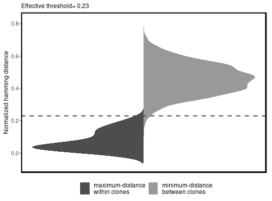
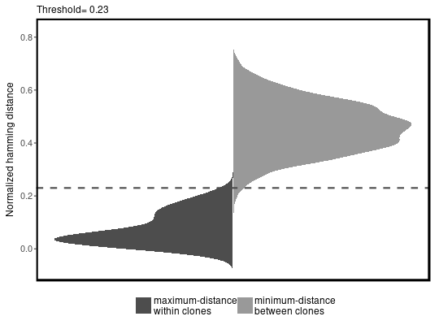

**clonesAnalysis** - *clonal assignment analysis*

Description
--------------------

The `clonesAnalysis` function performs a series of analysis to assess the performance of
`defineClonesScope` function.


Usage
--------------------
```
clonesAnalysis(db, junction = "JUNCTION", v_call = "V_CALL",
j_call = "J_CALL", clone = "CLONE", first = FALSE, cdr3 = FALSE,
nproc = 1, progress = FALSE)
```

Arguments
-------------------

db
:   data.frame with Change-O style columns containing sequence data.

junction
:   name of the column containing nucleotide sequences to compare.
Also used to determine sequence length for grouping.

v_call
:   name of the column containing the V-segment allele calls.

j_call
:   name of the column containing the J-segment allele calls.

clone
:   name of the data column containing clone identifiers.

first
:   if `TRUE` only the first call of the gene assignments
is used. if `FALSE` the union of ambiguous gene
assignments is used to group all sequences with any
overlapping gene calls.

cdr3
:   if `TRUE` remove 3 nts from both ends of `junction`
(converts IMGT junction to CDR3 region).

nproc
:   number of cores to distribute the function over.

progress
:   if `TRUE` print a progress bar.


Value
-------------------

Returns a [ClonesAnalysisResult](ClonesAnalysisResult-class.md) object.


Note
-------------------

Arguments `first` and `cdr3` must match the corresponding arguments
used in the [defineClonesScope](defineClonesScope.md) function.


Examples
-------------------

```R
# Readin example data as a demo
data(ClonedExampleDb, package="scope")

# clonal assignment analysis using clonesAnalysis function
results <- clonesAnalysis(db = ClonedExampleDb, junction = "JUNCTION", v_call = "V_CALL",
j_call = "J_CALL", clone = "CLONE", first = TRUE)
# print threshold (a numeric)
results@threshold

```


```
[1] 0.23

```


```R

# get inter and intra conal distances (a data.frame)
df <- results@interVsIntra[[1]]

# density plot of inter versus intra clonal distances  (a ggplot).
results@plotInterVsIntra

```


```
[[1]]

```



```


```


```R

# get the neighborhoods used in spectral clustering (a numeric vector).
ngs <- results@neighborhoods

# plot histogram of neighborhoods (a ggplot).
results@plotNeighborhoods
```


```
[[1]]

```



```


```


