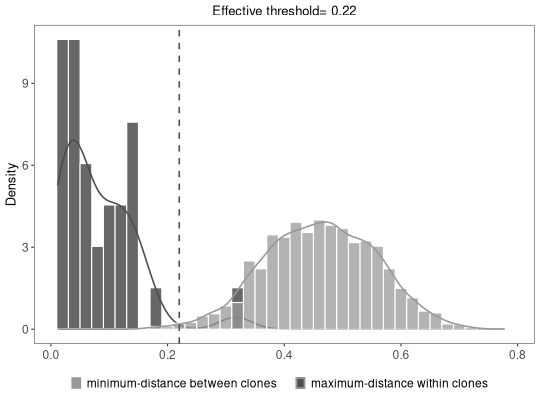

**hierarchicalClones** - *Hierarchical clustering-based method for partitioning Ig sequences into clones.*

Description
--------------------

The `hierarchicalClones` function provides a computational pipline for assigning Ig 
sequences into clonal groups sharing same V gene, J gene, and junction length, based on the 
junction sequence similarity.


Usage
--------------------
```
hierarchicalClones(
db,
threshold,
method = c("nt", "aa"),
linkage = c("single", "average", "complete"),
normalize = c("len", "none"),
junction = "junction",
v_call = "v_call",
j_call = "j_call",
clone = "clone_id",
first = FALSE,
cdr3 = FALSE,
mod3 = FALSE,
max_n = 0,
nproc = 1,
verbose = FALSE,
log = NULL,
summarize_clones = FALSE
)
```

Arguments
-------------------

db
:   data.frame containing sequence data.

threshold
:   a numeric scalar where the tree should be cut (the distance threshold for clonal grouping).

method
:   one of the `"nt"` for nucleotide based clustering or 
`"aa"` for amino acid based clustering.

linkage
:   available linkage are `"single"`, `"average"`, and `"complete"`.

normalize
:   method of normalization. The default is `"len"`, which divides the distance by the length 
of the sequence group. If `"none"` then no normalization if performed.

junction
:   character name of the column containing junction sequences.
Also used to determine sequence length for grouping.

v_call
:   character name of the column containing the V-segment allele calls.

j_call
:   character name of the column containing the J-segment allele calls.

clone
:   the output column name containing the clonal cluster identifiers.

first
:   specifies how to handle multiple V(D)J assignments for initial grouping. 
If `TRUE` only the first call of the gene assignments is used. 
If `FALSE` the union of ambiguous gene assignments is used to 
group all sequences with any overlapping gene calls.

cdr3
:   if `TRUE` removes 3 nucleotides from both ends of `"junction"` 
prior to clustering (converts IMGT junction to CDR3 region). 
If `TRUE` this will also remove records with a junction length 
less than 7 nucleotides.

mod3
:   if `TRUE` removes records with a `junction` length that is not divisible by 
3 in nucleotide space.

max_n
:   The maximum number of `N` characters to permit in the junction sequence 
before excluding the record from clonal assignment. Note, with 
`linkage="single"` non-informative positions can create artifactual 
links between unrelated sequences. Use with caution. 
Default is set to be zero. Set it as `"NULL"` for no action.

nproc
:   number of cores to distribute the function over.

verbose
:   if `TRUE` prints out a summary of each step cloning process.
if `FALSE` (default) process cloning silently.

log
:   specify the output path/filename.txt to save `verbose`. 
The input file directory is used if path is not specified.
The default is `NULL` for no action.

summarize_clones
:   if `TRUE` performs a series of analysis to assess the clonal landscape.
See Value for description.


Value
-------------------

For `summarize_clones=FALSE`, a modified data.frame with clone identifiers in the `clone` column. 
For `summarize_clones=TRUE` returns a [ScoperClones](ScoperClones-class.md) object including the modified `db` 
with clone identifiers, and other clones summary information.
If `log` is specified as output path/filename.txt, it will write verbose logging to a file in the output path. 
If `log` is specified as only a filename.txt, current directory is used. The default is `NULL` for no action.


Details
-------------------

`hierarchicalClones` provides a computational platform to explore the B cell clonal 
relationships in high-throughput Adaptive Immune Receptor Repertoire sequencing (AIRR-seq) 
data sets. This function performs hierarchical clustering among sequences of B cell receptors 
(BCRs, immunoglobulins, Ig) that share the same V gene, J gene, and junction length 
based on the junction sequence similarity:


Examples
-------------------

```R
results <- hierarchicalClones(ExampleDb, threshold=0.15,
method="nt", linkage="single",
junction="junction", 
v_call="v_call", j_call="j_call", 
summarize_clones=TRUE)

```

*Warning*:`data_frame()` is deprecated as of tibble 1.1.0.
Please use `tibble()` instead.
This warning is displayed once every 8 hours.
Call `lifecycle::last_warnings()` to see where this warning was generated.
```R

# Plot clonal summaries 
plot(results, binwidth=0.02)
```




See also
-------------------

See [plotCloneSummary](plotCloneSummary.md) for generating a ggplot object from `summarize_clones=TRUE`
method.


