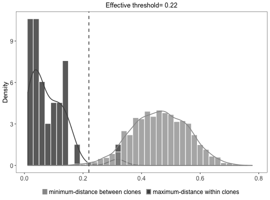

**hierarchicalClones** - *Hierarchical clustering-based method for partitioning Ig sequences into clones.*

Description
--------------------

The `hierarchicalClones` function provides a computational pipline for assigning Ig 
sequences into clonal groups sharing same V gene, J gene, and junction length, based on the 
junction sequence similarity.


Usage
--------------------
```
hierarchicalClones(
db,
threshold,
method = c("nt", "aa"),
linkage = c("single", "average", "complete"),
normalize = c("len", "none"),
junction = "junction",
v_call = "v_call",
j_call = "j_call",
clone = "clone_id",
cell_id = NULL,
locus = NULL,
only_heavy = TRUE,
split_light = TRUE,
first = FALSE,
cdr3 = FALSE,
mod3 = FALSE,
max_n = 0,
nproc = 1,
verbose = FALSE,
log = NULL,
summarize_clones = TRUE
)
```

Arguments
-------------------

db
:   data.frame containing sequence data.

threshold
:   a numeric scalar where the tree should be cut (the distance threshold for clonal grouping).

method
:   one of the `"nt"` for nucleotide based clustering or 
`"aa"` for amino acid based clustering.

linkage
:   available linkage are `"single"`, `"average"`, and `"complete"`.

normalize
:   method of normalization. The default is `"len"`, which divides the distance by the length 
of the sequence group. If `"none"` then no normalization if performed.

junction
:   character name of the column containing junction sequences.
Also used to determine sequence length for grouping.

v_call
:   character name of the column containing the V-segment allele calls.

j_call
:   character name of the column containing the J-segment allele calls.

clone
:   the output column name containing the clonal cluster identifiers.

cell_id
:   name of the column containing cell IDs. Only 
applicable and required for single-cell mode.

locus
:   name of the column containing locus information. 
Only applicable and required for single-cell mode.

only_heavy
:   use only `IGH` (for BCR) or `TRB/TRD` (for TCR) 
sequences for grouping. Only applicable and required for 
single-cell mode. Default is `TRUE`.

split_light
:   split clones by light chains. Only applicable and required for
single-cell mode. Default is `TRUE`.

first
:   specifies how to handle multiple V(D)J assignments for initial grouping. 
If `TRUE` only the first call of the gene assignments is used. 
If `FALSE` the union of ambiguous gene assignments is used to 
group all sequences with any overlapping gene calls.

cdr3
:   if `TRUE` removes 3 nucleotides from both ends of `"junction"` 
prior to clustering (converts IMGT junction to CDR3 region). 
If `TRUE` this will also remove records with a junction length 
less than 7 nucleotides.

mod3
:   if `TRUE` removes records with a `junction` length that is not divisible by 
3 in nucleotide space.

max_n
:   The maximum number of `N` characters to permit in the junction sequence 
before excluding the record from clonal assignment. Note, with 
`linkage="single"` non-informative positions can create artifactual 
links between unrelated sequences. Use with caution. 
Default is set to be zero. Set it as `"NULL"` for no action.

nproc
:   number of cores to distribute the function over.

verbose
:   if `TRUE` prints out a summary of each step cloning process.
if `FALSE` (default) process cloning silently.

log
:   output path and filename to save the `verbose` log. 
The input file directory is used if path is not specified.
The default is `NULL` for no action.

summarize_clones
:   if `TRUE` performs a series of analysis to assess the clonal landscape
and returns a [ScoperClones](ScoperClones-class.md) object. If `FALSE` then
a modified input `db` is returned.


Value
-------------------

If `summarize_clones=TRUE` (default) a [ScoperClones](ScoperClones-class.md) object is returned that includes the 
clonal assignment summary information and a modified input `db` in the `db` slot that 
contains clonal identifiers in the specified `clone` column.
If `summarize_clones=FALSE` modified `data.frame` is returned with clone identifiers in the 
specified `clone` column.


Details
-------------------

`hierarchicalClones` provides a computational platform to explore the B cell clonal 
relationships in high-throughput Adaptive Immune Receptor Repertoire sequencing (AIRR-seq) 
data sets. This function performs hierarchical clustering among sequences of B cell receptors 
(BCRs, immunoglobulins, Ig) that share the same V gene, J gene, and junction length 
based on the junction sequence similarity: 

To invoke single-cell mode, both `cell_id` and `locus` must be supplied. Otherwise,
the function will run under non-single-cell mode, using all input sequences regardless of the
value in the `locus` column. If only one of these arguments be supplied, the function will 
returns an error message and stops.

Values in the `locus` column must be one of `c("IGH", "IGI", "IGK", "IGL"` for BCR 
or `"TRA", "TRB", "TRD", "TRG")` for TCR sequences. Otherwise, the function returns an 
error message and stops.

Under single-cell mode for VH:VL paired sequences, there is a choice of whether grouping
should be done using `IGH` for BCR or `TRB/TRD` for TCR sequences only, or using 
both `IGH, IGK/IGL` for BCR or `TRB/TRD, TRA/TRG` for TCR sequences.  
This is governed by `only_heavy`.


Under single-cell mode for VH:VL paired sequences, there is a choice to split the inferred clones
by `IGK/IGL` for BCR sequences or `TRA/TRG` for TCR sequences. 
This is governed by `split_light`.

Under single-cell mode the cloning is perfomred based on the heavy chain (`IGH`) sequences only. 
It is required that only one heavy chain per cell exists. Otherwise, the function will returns 
an error message and stops. Cells without any heavy chain will be assigned by a "NA" clone id.


Examples
-------------------

```R
# Find clonal groups
results <- hierarchicalClones(ExampleDb, threshold=0.15)

# Retrieve modified input data with clonal clustering identifiers
df <- as.data.frame(results)

# Plot clonal summaries 
plot(results, binwidth=0.02)
```




See also
-------------------

See [plotCloneSummary](plotCloneSummary.md) for plotting summary results. See [groupGenes](http://www.rdocumentation.org/packages/alakazam/topics/groupGenes) for 
more details about grouping requirements.


