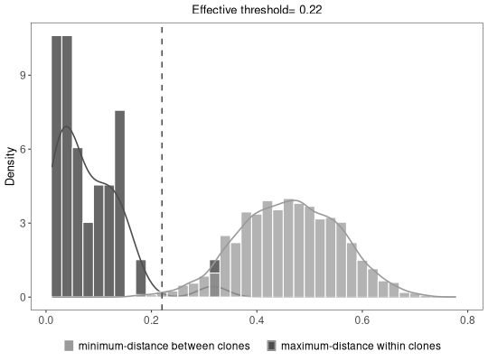

**hierarchicalClones** - *Hierarchical clustering method for clonal partitioning*

Description
--------------------

`hierarchicalClones` provides a hierarchical agglomerative clustering 
approach to infer clonal relationships in high-throughput Adaptive Immune Receptor 
Repertoire sequencing (AIRR-seq) data. This approach clusters B or T cell receptor 
sequences based on junction region sequence similarity within partitions that share the 
same V gene, J gene, and junction length, allowing for ambiguous V or J gene annotations.


Usage
--------------------
```
hierarchicalClones(
db,
threshold,
method = c("nt", "aa"),
linkage = c("single", "average", "complete"),
normalize = c("len", "none"),
IUPAC = FALSE,
junction = "junction",
v_call = "v_call",
j_call = "j_call",
clone = "clone_id",
fields = NULL,
cell_id = NULL,
locus = "locus",
only_heavy = TRUE,
split_light = FALSE,
first = FALSE,
cdr3 = FALSE,
mod3 = FALSE,
max_n = 0,
nproc = 1,
verbose = FALSE,
log = NULL,
summarize_clones = FALSE,
seq_id = "sequence_id"
)
```

Arguments
-------------------

db
:   data.frame containing sequence data.

threshold
:   numeric scalar where the tree should be cut (the distance threshold for clonal grouping).

method
:   one of the `"nt"` for nucleotide based clustering or 
`"aa"` for amino acid based clustering. Method `"aa"` still expects nucleotide sequences, 
which will be translated to amino acids

linkage
:   available linkage are `"single"`, `"average"`, and `"complete"`.

normalize
:   method of normalization. The default is `"len"`, which divides the distance by the length 
of the sequence group. If `"none"` then no normalization if performed.

IUPAC
:   If `TRUE`, allows sequences with IUPAC codes to pass validation 
and be used in clustering with IUPAC-aware distance calculation 
(via `alakazam::pairwiseDist`). If `FALSE` (default), uses fast Hamming distance 
(via `fastDist_rcpp`) and only allows standard bases (A, T, C, G), N, and ? 
in sequences. This parameter controls validation and distance
calculation method, not sequence filtering. See `max_n` for 
filtering sequences by character content. See the IUPAC and max_n 
parameters section for more details and examples. Note: This parameter is only available 
for `hierarchicalClones` with `method="nt"`.

junction
:   character name of the column containing junction sequences.
Also used to determine sequence length for grouping.

v_call
:   name of the column containing the V-segment allele calls.

j_call
:   name of the column containing the J-segment allele calls.

clone
:   output column name containing the clonal cluster identifiers.

fields
:   character vector of additional columns to use for grouping. 
Sequences with disjoint values in the specified fields will be classified 
as separate clones.

cell_id
:   name of the column containing cell identifiers or barcodes. 
If specified, grouping will be performed in single-cell mode
with the behavior governed by the `locus` and 
`only_heavy` arguments. If set to `NULL` then the 
bulk sequencing data is assumed.

locus
:   name of the column containing locus information. 
Only applicable to single-cell data.
Ignored if `cell_id=NULL`.

only_heavy
:   This is deprecated. Only heavy chains will be used in clustering.
Use only the IGH (BCR) or TRB/TRD (TCR) sequences 
for grouping. Only applicable to single-cell data.
Ignored if `cell_id=NULL`.

split_light
:   This is deprecated. If you desire to split clones by light chains 
use dowser::resolveLightChains.

first
:   specifies how to handle multiple V(D)J assignments for initial grouping. 
If `TRUE` only the first call of the gene assignments is used. 
If `FALSE` the union of ambiguous gene assignments is used to 
group all sequences with any overlapping gene calls.

cdr3
:   if `TRUE` removes 3 nucleotides from both ends of `"junction"` 
prior to clustering (converts IMGT junction to CDR3 region). 
If `TRUE` this will also remove records with a junction length 
less than 7 nucleotides.

mod3
:   if `TRUE` removes records with a `junction` length that is not divisible by 
3 in nucleotide space.

max_n
:   The maximum number of non-ATCG characters (degenerate positions) to permit 
in the junction sequence before excluding the record from clonal assignment. 
Note: `max_n` operates independently 
from `IUPAC` - it controls filtering by character count, while 
`IUPAC` controls validation and distance calculation method. 
With `linkage="single"`, non-informative positions can create 
artifactual links between unrelated sequences. Use with caution. 
Default is 0 (ATCG-only). Set to `NULL` for no filtering.

nproc
:   number of cores to distribute the function over.

verbose
:   if `TRUE` prints out a summary of each step cloning process.
if `FALSE` (default) process cloning silently.

log
:   output path and filename to save the `verbose` log. 
The input file directory is used if path is not specified.
The default is `NULL` for no action.

summarize_clones
:   if `TRUE` performs a series of analysis to assess the clonal landscape
and returns a [ScoperClones](ScoperClones-class.md) object. If `FALSE` (default) then
a modified input `db` is returned with clone identifiers in the specified 
`clone` column. When grouping by `fields`, 
`summarize_clones` should be `FALSE`.

seq_id
:   The column containing sequence ids


Value
-------------------

If `summarize_clones=FALSE` (default) a modified `data.frame` is returned with clone identifiers in the 
specified `clone` column.
If `summarize_clones=TRUE` a [ScoperClones](ScoperClones-class.md) object is returned that includes the 
clonal assignment summary information and a modified input `db` in the `db` slot that 
contains clonal identifiers in the specified `clone` column.


IUPAC and max_n parameters
-------------------


Note: The `IUPAC` parameter is only available for `hierarchicalClones` with 
`method="nt"` (nucleotide mode). It is ignored when `method="aa"` (amino acid mode). 
The `max_n` parameter is available for all cloning functions.

The `IUPAC` and `max_n` parameters serve complementary but distinct purposes:

`IUPAC` controls:

+  Sequence validation (which characters are allowed)
+  Distance calculation method (fast Hamming vs IUPAC-aware scoring)


`max_n` controls:

+  Sequence filtering by counting non-ATCG characters in the junction


`hierarchicalClones` with `method="aa"` accepts the full IUPAC DNA alphabet during validation, 
then `max_n` controls filtering of sequences containing excess non-ATCG characters 
before translating to amino acids and performing IUPAC-aware clustering.

Example use cases for `hierarchicalClones` with `method="nt"`:

+  `IUPAC=FALSE, max_n=0`: Strict ATCG-only mode with fast distance calculation. 
Will throw an error and exit if sequences with characters not A, T, C, G, N, or ? are detected.
max_n=0 will filter out sequences with N or ? characters. Fastest option for high-quality data.
+  `IUPAC=FALSE, max_n>0`: Will throw an error and exit if sequences with characters
not A, T, C, G, N, or ? are detected. Allows sequences 
with limited N/? characters in distance calculation, using fast Hamming distance. 
Note: IUPAC codes are rejected during validation (before max_n filtering), so max_n only 
controls filtering of sequences with N or ? characters. Useful for data with low-quality 
or masked positions but no experimental ambiguity codes.
+  `IUPAC=TRUE, max_n=0`: Uses IUPAC-aware distance but filters out all non-ATCG 
characters anyway. Only standard bases remain after filtering. Slower than IUPAC=FALSE 
but handles any ambiguity codes in the input by filtering them out before clustering.
+  `IUPAC=TRUE, max_n>0`: Allows sequences with limited ambiguity codes and uses 
proper IUPAC-aware distance calculation. Slower but handles biological ambiguity correctly. 
Set max_n to the maximum number of ambiguous positions per sequence you want to tolerate 
(counts all non-ATCG: N, ?, and other IUPAC codes).
+  `IUPAC=TRUE, max_n=NULL`: Process all sequences with IUPAC codes regardless of the 
number of ambiguous positions. Uses IUPAC-aware distance calculation with no filtering. 
Most permissive option.


Note: Validation occurs before filtering. When `IUPAC=FALSE`, sequences containing IUPAC 
ambiguity codes (R, Y, W, S, M, K, etc.) will fail validation and be rejected before the 
`max_n` filtering step. Therefore, with `IUPAC=FALSE, max_n > 0`, only sequences 
with N and ? characters (not IUPAC codes) can pass validation and be filtered by `max_n`. 
The `max_n` parameter always counts using regex `"[^ATCG]"`, but `IUPAC` determines 
which non-ATCG characters are allowed to reach the filtering step.


Single-cell data
-------------------


To invoke single-cell mode the `cell_id` argument must be specified and the `locus` 
column must be correct. Otherwise, clustering will be performed with bulk sequencing assumptions, 
using all input sequences regardless of the values in the `locus` column.

Values in the `locus` column must be one of `c("IGH", "IGI", "IGK", "IGL")` for BCR 
or `c("TRA", "TRB", "TRD", "TRG")` for TCR sequences. Otherwise, the operation will exit and 
return an error message.

Under single-cell mode with paired-chain sequences, there is a choice of whether 
grouping should be done by (a) using IGH (BCR) or TRB/TRD (TCR) sequences only or
(b) using IGH plus IGK/IGL (BCR) or TRB/TRD plus TRA/TRG (TCR) sequences. 
This is governed by the `only_heavy` argument. There is also choice as to whether 
inferred clones should be split by the light/short chain (IGK, IGL, TRA, TRG) following 
heavy/long chain clustering, which is governed by the `split_light` argument.

In single-cell mode, clonal clustering will not be performed on data where cells are 
assigned multiple heavy/long chain sequences (IGH, TRB, TRD). If observed, the operation 
will exit and return an error message. Cells that lack a heavy/long chain sequence (i.e., cells with 
light/short chains only) will be assigned a `clone_id` of `NA`.


Examples
-------------------

```R
# Find clonal groups
results <- hierarchicalClones(ExampleDb, threshold=0.15, summarize_clones=TRUE)

```


```
In modified Functions.R
```

*Running defineClonesScoper in bulk mode and only keep heavy chains*
```R

# Retrieve modified input data with clonal clustering identifiers
df <- as.data.frame(results)

# Plot clonal summaries
plot(results, binwidth=0.02)

```




See also
-------------------

See [plotCloneSummary](plotCloneSummary.md) for plotting summary results. See [groupGenes](http://www.rdocumentation.org/packages/alakazam/topics/groupGenes) for 
more details about grouping requirements.


