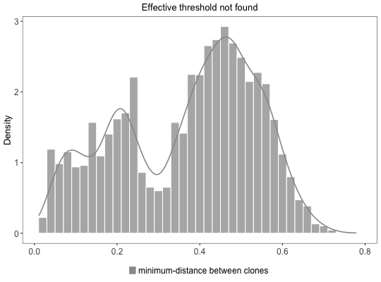

**identicalClones** - *Identical clustering-based method for partitioning Ig sequences into clones.*

Description
--------------------

The `identicalClones` function provides a computational pipline for assigning Ig 
sequences into clonal groups sharing same V gene, J gene, and identical junction.


Usage
--------------------
```
identicalClones(
db,
method = c("nt", "aa"),
junction = "junction",
v_call = "v_call",
j_call = "j_call",
clone = "clone_id",
first = FALSE,
cdr3 = FALSE,
mod3 = FALSE,
max_n = 0,
nproc = 1,
verbose = FALSE,
log = NULL,
summarize_clones = TRUE
)
```

Arguments
-------------------

db
:   data.frame containing sequence data.

method
:   one of the `"nt"` for nucleotide based clustering or 
`"aa"` for amino acid based clustering.

junction
:   character name of the column containing junction sequences.
Also used to determine sequence length for grouping.

v_call
:   character name of the column containing the V-segment allele calls.

j_call
:   character name of the column containing the J-segment allele calls.

clone
:   the output column name containing the clonal clustering identifiers.

first
:   specifies how to handle multiple V(D)J assignments for initial grouping. 
If `TRUE` only the first call of the gene assignments is used. 
If `FALSE` the union of ambiguous gene assignments is used to 
group all sequences with any overlapping gene calls.

cdr3
:   if `TRUE` removes 3 nucleotides from both ends of `"junction"` 
prior to clustering (converts IMGT junction to CDR3 region). 
If `TRUE` this will also remove records with a junction length 
less than 7 nucleotides.

mod3
:   if `TRUE` removes records with a `junction` length that is not divisible by 
3 in nucleotide space.

max_n
:   The maximum number of N's to permit in the junction sequence before excluding the 
record from clonal assignment. Default is set to be zero. Set it as `"NULL"` for no 
action.

nproc
:   number of cores to distribute the function over.

verbose
:   if `TRUE` prints out a summary of each step cloning process.
if `FALSE` (default) process cloning silently.

log
:   output path and filename to save the `verbose` log. 
The input file directory is used if path is not specified.
The default is `NULL` for no action.

summarize_clones
:   if `TRUE` performs a series of analysis to assess the clonal landscape
and returns a [ScoperClones](ScoperClones-class.md) object. If `FALSE` then
a modified input `db` is returned.


Value
-------------------

If `summarize_clones=TRUE` (default) a [ScoperClones](ScoperClones-class.md) object is returned that includes the 
clonal assignment summary information and a modified input `db` in the `db` slot that 
contains clonal identifiers in the specified `clone` column.
If `summarize_clones=FALSE` modified `data.frame` is returned with clone identifiers in the 
specified `clone` column.


Details
-------------------

`identicalClones` provides a computational platform to explore the B cell clonal 
relationships in high-throughput Adaptive Immune Receptor Repertoire sequencing (AIRR-seq) 
data sets. This function performs clustering among sequences of B cell receptors 
(BCRs, immunoglobulins, Ig) that share the same V gene, J gene, and identical junction:


Examples
-------------------

```R
# Find clonal groups
results <- identicalClones(ExampleDb)

# Retrieve modified input data with clonal clustering identifiers
df <- as.data.frame(results)

# Plot clonal summaries 
plot(results, binwidth=0.02)
```




See also
-------------------

See [plotCloneSummary](plotCloneSummary.md) plotting summary results.


