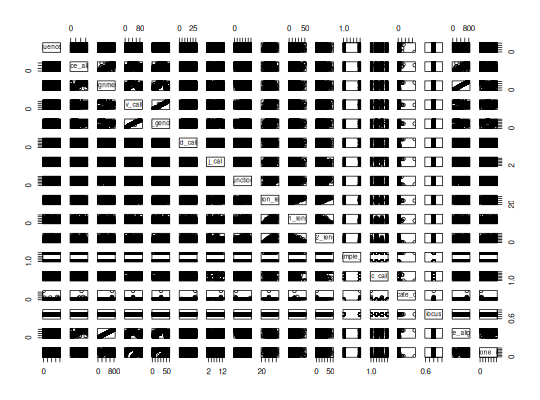

**identicalClones** - *Sequence identity method for clonal partitioning*

Description
--------------------

`identicalClones` provides a simple sequence identity based partitioning 
approach for inferring clonal relationships in high-throughput Adaptive Immune Receptor 
Repertoire sequencing (AIRR-seq) data. This approach partitions B or T cell receptor 
sequences into clonal groups based on junction region sequence identity within 
partitions that share the same V gene, J gene, and junction length, allowing for 
ambiguous V or J gene annotations.


Usage
--------------------
```
identicalClones(
db,
method = c("nt", "aa"),
junction = "junction",
v_call = "v_call",
j_call = "j_call",
clone = "clone_id",
fields = NULL,
cell_id = NULL,
locus = "locus",
only_heavy = TRUE,
split_light = FALSE,
first = FALSE,
cdr3 = FALSE,
mod3 = FALSE,
max_n = 0,
nproc = 1,
verbose = FALSE,
log = NULL,
summarize_clones = FALSE
)
```

Arguments
-------------------

db
:   data.frame containing sequence data.

method
:   one of the `"nt"` for nucleotide based clustering or 
`"aa"` for amino acid based clustering.

junction
:   character name of the column containing junction sequences.
Also used to determine sequence length for grouping.

v_call
:   name of the column containing the V-segment allele calls.

j_call
:   name of the column containing the J-segment allele calls.

clone
:   output column name containing the clonal cluster identifiers.

fields
:   character vector of additional columns to use for grouping. 
Sequences with disjoint values in the specified fields will be classified 
as separate clones.

cell_id
:   name of the column containing cell identifiers or barcodes. 
If specified, grouping will be performed in single-cell mode
with the behavior governed by the `locus` and 
`only_heavy` arguments. If set to `NULL` then the 
bulk sequencing data is assumed.

locus
:   name of the column containing locus information. 
Only applicable to single-cell data.
Ignored if `cell_id=NULL`.

only_heavy
:   This is deprecated. Only heavy chains will be used in clustering.
Use only the IGH (BCR) or TRB/TRD (TCR) sequences 
for grouping. Only applicable to single-cell data.
Ignored if `cell_id=NULL`.

split_light
:   This is deprecated. If you desire to split clones by light chains 
use dowser::resolveLightChains.

first
:   specifies how to handle multiple V(D)J assignments for initial grouping. 
If `TRUE` only the first call of the gene assignments is used. 
If `FALSE` the union of ambiguous gene assignments is used to 
group all sequences with any overlapping gene calls.

cdr3
:   if `TRUE` removes 3 nucleotides from both ends of `"junction"` 
prior to clustering (converts IMGT junction to CDR3 region). 
If `TRUE` this will also remove records with a junction length 
less than 7 nucleotides.

mod3
:   if `TRUE` removes records with a `junction` length that is not divisible by 
3 in nucleotide space.

max_n
:   The maximum number of degenerate characters to permit in the junction sequence before excluding the 
record from clonal assignment. Default is set to be zero. Set it as `"NULL"` for no 
action.

nproc
:   number of cores to distribute the function over.

verbose
:   if `TRUE` prints out a summary of each step cloning process.
if `FALSE` (default) process cloning silently.

log
:   output path and filename to save the `verbose` log. 
The input file directory is used if path is not specified.
The default is `NULL` for no action.

summarize_clones
:   if `TRUE` performs a series of analysis to assess the clonal landscape
and returns a [ScoperClones](ScoperClones-class.md) object. If `FALSE` (default) then
a modified input `db` is returned. When grouping by `fields`, 
`summarize_clones` should be `FALSE`.


Value
-------------------

If `summarize_clones=FALSE` (default) a modified `data.frame` is returned with clone identifiers in the 
specified `clone` column.
If `summarize_clones=TRUE` a [ScoperClones](ScoperClones-class.md) object is returned that includes the 
clonal assignment summary information and a modified input `db` in the `db` slot that 
contains clonal identifiers in the specified `clone` column.


Single-cell data
-------------------


To invoke single-cell mode the `cell_id` argument must be specified and the `locus` 
column must be correct. Otherwise, clustering will be performed with bulk sequencing assumptions, 
using all input sequences regardless of the values in the `locus` column.

Values in the `locus` column must be one of `c("IGH", "IGI", "IGK", "IGL")` for BCR 
or `c("TRA", "TRB", "TRD", "TRG")` for TCR sequences. Otherwise, the operation will exit and 
return an error message.

Under single-cell mode with paired-chain sequences, there is a choice of whether 
grouping should be done by (a) using IGH (BCR) or TRB/TRD (TCR) sequences only or
(b) using IGH plus IGK/IGL (BCR) or TRB/TRD plus TRA/TRG (TCR) sequences. 
This is governed by the `only_heavy` argument. There is also choice as to whether 
inferred clones should be split by the light/short chain (IGK, IGL, TRA, TRG) following 
heavy/long chain clustering, which is governed by the `split_light` argument.

In single-cell mode, clonal clustering will not be performed on data where cells are 
assigned multiple heavy/long chain sequences (IGH, TRB, TRD). If observed, the operation 
will exit and return an error message. Cells that lack a heavy/long chain sequence (i.e., cells with 
light/short chains only) will be assigned a `clone_id` of `NA`.


Examples
-------------------

```R
# Find clonal groups
results <- identicalClones(ExampleDb)

```

*Running defineClonesScoper in bulk mode and only keep heavy chains*
```R

# Retrieve modified input data with clonal clustering identifiers
df <- as.data.frame(results)

# Plot clonal summaries
plot(results, binwidth=0.02)

```

*Warning*:"binwidth" is not a graphical parameter*Warning*:"binwidth" is not a graphical parameter*Warning*:"binwidth" is not a graphical parameter*Warning*:"binwidth" is not a graphical parameter*Warning*:"binwidth" is not a graphical parameter*Warning*:"binwidth" is not a graphical parameter*Warning*:"binwidth" is not a graphical parameter*Warning*:"binwidth" is not a graphical parameter*Warning*:"binwidth" is not a graphical parameter*Warning*:"binwidth" is not a graphical parameter*Warning*:"binwidth" is not a graphical parameter*Warning*:"binwidth" is not a graphical parameter*Warning*:"binwidth" is not a graphical parameter*Warning*:"binwidth" is not a graphical parameter*Warning*:"binwidth" is not a graphical parameter*Warning*:"binwidth" is not a graphical parameter*Warning*:"binwidth" is not a graphical parameter*Warning*:"binwidth" is not a graphical parameter*Warning*:"binwidth" is not a graphical parameter*Warning*:"binwidth" is not a graphical parameter*Warning*:"binwidth" is not a graphical parameter*Warning*:"binwidth" is not a graphical parameter*Warning*:"binwidth" is not a graphical parameter*Warning*:"binwidth" is not a graphical parameter*Warning*:"binwidth" is not a graphical parameter*Warning*:"binwidth" is not a graphical parameter*Warning*:"binwidth" is not a graphical parameter*Warning*:"binwidth" is not a graphical parameter*Warning*:"binwidth" is not a graphical parameter*Warning*:"binwidth" is not a graphical parameter*Warning*:"binwidth" is not a graphical parameter*Warning*:"binwidth" is not a graphical parameter*Warning*:"binwidth" is not a graphical parameter*Warning*:"binwidth" is not a graphical parameter*Warning*:"binwidth" is not a graphical parameter*Warning*:"binwidth" is not a graphical parameter*Warning*:"binwidth" is not a graphical parameter*Warning*:"binwidth" is not a graphical parameter*Warning*:"binwidth" is not a graphical parameter*Warning*:"binwidth" is not a graphical parameter*Warning*:"binwidth" is not a graphical parameter*Warning*:"binwidth" is not a graphical parameter*Warning*:"binwidth" is not a graphical parameter*Warning*:"binwidth" is not a graphical parameter*Warning*:"binwidth" is not a graphical parameter*Warning*:"binwidth" is not a graphical parameter*Warning*:"binwidth" is not a graphical parameter*Warning*:"binwidth" is not a graphical parameter*Warning*:"binwidth" is not a graphical parameter*Warning*:"binwidth" is not a graphical parameter*Warning*:"binwidth" is not a graphical parameter*Warning*:"binwidth" is not a graphical parameter*Warning*:"binwidth" is not a graphical parameter*Warning*:"binwidth" is not a graphical parameter*Warning*:"binwidth" is not a graphical parameter*Warning*:"binwidth" is not a graphical parameter*Warning*:"binwidth" is not a graphical parameter*Warning*:"binwidth" is not a graphical parameter*Warning*:"binwidth" is not a graphical parameter*Warning*:"binwidth" is not a graphical parameter*Warning*:"binwidth" is not a graphical parameter*Warning*:"binwidth" is not a graphical parameter*Warning*:"binwidth" is not a graphical parameter*Warning*:"binwidth" is not a graphical parameter*Warning*:"binwidth" is not a graphical parameter*Warning*:"binwidth" is not a graphical parameter*Warning*:"binwidth" is not a graphical parameter*Warning*:"binwidth" is not a graphical parameter*Warning*:"binwidth" is not a graphical parameter*Warning*:"binwidth" is not a graphical parameter*Warning*:"binwidth" is not a graphical parameter*Warning*:"binwidth" is not a graphical parameter*Warning*:"binwidth" is not a graphical parameter*Warning*:"binwidth" is not a graphical parameter*Warning*:"binwidth" is not a graphical parameter*Warning*:"binwidth" is not a graphical parameter*Warning*:"binwidth" is not a graphical parameter*Warning*:"binwidth" is not a graphical parameter*Warning*:"binwidth" is not a graphical parameter*Warning*:"binwidth" is not a graphical parameter*Warning*:"binwidth" is not a graphical parameter*Warning*:"binwidth" is not a graphical parameter*Warning*:"binwidth" is not a graphical parameter*Warning*:"binwidth" is not a graphical parameter*Warning*:"binwidth" is not a graphical parameter*Warning*:"binwidth" is not a graphical parameter*Warning*:"binwidth" is not a graphical parameter*Warning*:"binwidth" is not a graphical parameter*Warning*:"binwidth" is not a graphical parameter*Warning*:"binwidth" is not a graphical parameter*Warning*:"binwidth" is not a graphical parameter*Warning*:"binwidth" is not a graphical parameter*Warning*:"binwidth" is not a graphical parameter*Warning*:"binwidth" is not a graphical parameter*Warning*:"binwidth" is not a graphical parameter*Warning*:"binwidth" is not a graphical parameter*Warning*:"binwidth" is not a graphical parameter*Warning*:"binwidth" is not a graphical parameter*Warning*:"binwidth" is not a graphical parameter*Warning*:"binwidth" is not a graphical parameter*Warning*:"binwidth" is not a graphical parameter*Warning*:"binwidth" is not a graphical parameter*Warning*:"binwidth" is not a graphical parameter*Warning*:"binwidth" is not a graphical parameter*Warning*:"binwidth" is not a graphical parameter*Warning*:"binwidth" is not a graphical parameter*Warning*:"binwidth" is not a graphical parameter*Warning*:"binwidth" is not a graphical parameter*Warning*:"binwidth" is not a graphical parameter*Warning*:"binwidth" is not a graphical parameter*Warning*:"binwidth" is not a graphical parameter*Warning*:"binwidth" is not a graphical parameter*Warning*:"binwidth" is not a graphical parameter*Warning*:"binwidth" is not a graphical parameter*Warning*:"binwidth" is not a graphical parameter*Warning*:"binwidth" is not a graphical parameter*Warning*:"binwidth" is not a graphical parameter*Warning*:"binwidth" is not a graphical parameter*Warning*:"binwidth" is not a graphical parameter*Warning*:"binwidth" is not a graphical parameter*Warning*:"binwidth" is not a graphical parameter*Warning*:"binwidth" is not a graphical parameter*Warning*:"binwidth" is not a graphical parameter*Warning*:"binwidth" is not a graphical parameter*Warning*:"binwidth" is not a graphical parameter*Warning*:"binwidth" is not a graphical parameter*Warning*:"binwidth" is not a graphical parameter*Warning*:"binwidth" is not a graphical parameter*Warning*:"binwidth" is not a graphical parameter*Warning*:"binwidth" is not a graphical parameter*Warning*:"binwidth" is not a graphical parameter*Warning*:"binwidth" is not a graphical parameter*Warning*:"binwidth" is not a graphical parameter*Warning*:"binwidth" is not a graphical parameter*Warning*:"binwidth" is not a graphical parameter*Warning*:"binwidth" is not a graphical parameter*Warning*:"binwidth" is not a graphical parameter*Warning*:"binwidth" is not a graphical parameter*Warning*:"binwidth" is not a graphical parameter*Warning*:"binwidth" is not a graphical parameter*Warning*:"binwidth" is not a graphical parameter*Warning*:"binwidth" is not a graphical parameter*Warning*:"binwidth" is not a graphical parameter*Warning*:"binwidth" is not a graphical parameter*Warning*:"binwidth" is not a graphical parameter*Warning*:"binwidth" is not a graphical parameter*Warning*:"binwidth" is not a graphical parameter*Warning*:"binwidth" is not a graphical parameter*Warning*:"binwidth" is not a graphical parameter*Warning*:"binwidth" is not a graphical parameter*Warning*:"binwidth" is not a graphical parameter*Warning*:"binwidth" is not a graphical parameter*Warning*:"binwidth" is not a graphical parameter*Warning*:"binwidth" is not a graphical parameter*Warning*:"binwidth" is not a graphical parameter*Warning*:"binwidth" is not a graphical parameter*Warning*:"binwidth" is not a graphical parameter*Warning*:"binwidth" is not a graphical parameter*Warning*:"binwidth" is not a graphical parameter*Warning*:"binwidth" is not a graphical parameter*Warning*:"binwidth" is not a graphical parameter*Warning*:"binwidth" is not a graphical parameter*Warning*:"binwidth" is not a graphical parameter*Warning*:"binwidth" is not a graphical parameter*Warning*:"binwidth" is not a graphical parameter*Warning*:"binwidth" is not a graphical parameter*Warning*:"binwidth" is not a graphical parameter*Warning*:"binwidth" is not a graphical parameter*Warning*:"binwidth" is not a graphical parameter*Warning*:"binwidth" is not a graphical parameter*Warning*:"binwidth" is not a graphical parameter*Warning*:"binwidth" is not a graphical parameter*Warning*:"binwidth" is not a graphical parameter*Warning*:"binwidth" is not a graphical parameter*Warning*:"binwidth" is not a graphical parameter*Warning*:"binwidth" is not a graphical parameter*Warning*:"binwidth" is not a graphical parameter*Warning*:"binwidth" is not a graphical parameter*Warning*:"binwidth" is not a graphical parameter*Warning*:"binwidth" is not a graphical parameter*Warning*:"binwidth" is not a graphical parameter*Warning*:"binwidth" is not a graphical parameter*Warning*:"binwidth" is not a graphical parameter*Warning*:"binwidth" is not a graphical parameter*Warning*:"binwidth" is not a graphical parameter*Warning*:"binwidth" is not a graphical parameter*Warning*:"binwidth" is not a graphical parameter*Warning*:"binwidth" is not a graphical parameter*Warning*:"binwidth" is not a graphical parameter*Warning*:"binwidth" is not a graphical parameter*Warning*:"binwidth" is not a graphical parameter*Warning*:"binwidth" is not a graphical parameter*Warning*:"binwidth" is not a graphical parameter*Warning*:"binwidth" is not a graphical parameter*Warning*:"binwidth" is not a graphical parameter*Warning*:"binwidth" is not a graphical parameter*Warning*:"binwidth" is not a graphical parameter*Warning*:"binwidth" is not a graphical parameter*Warning*:"binwidth" is not a graphical parameter*Warning*:"binwidth" is not a graphical parameter*Warning*:"binwidth" is not a graphical parameter*Warning*:"binwidth" is not a graphical parameter*Warning*:"binwidth" is not a graphical parameter*Warning*:"binwidth" is not a graphical parameter*Warning*:"binwidth" is not a graphical parameter*Warning*:"binwidth" is not a graphical parameter*Warning*:"binwidth" is not a graphical parameter*Warning*:"binwidth" is not a graphical parameter*Warning*:"binwidth" is not a graphical parameter*Warning*:"binwidth" is not a graphical parameter*Warning*:"binwidth" is not a graphical parameter*Warning*:"binwidth" is not a graphical parameter*Warning*:"binwidth" is not a graphical parameter*Warning*:"binwidth" is not a graphical parameter*Warning*:"binwidth" is not a graphical parameter*Warning*:"binwidth" is not a graphical parameter*Warning*:"binwidth" is not a graphical parameter*Warning*:"binwidth" is not a graphical parameter*Warning*:"binwidth" is not a graphical parameter*Warning*:"binwidth" is not a graphical parameter*Warning*:"binwidth" is not a graphical parameter*Warning*:"binwidth" is not a graphical parameter*Warning*:"binwidth" is not a graphical parameter*Warning*:"binwidth" is not a graphical parameter*Warning*:"binwidth" is not a graphical parameter*Warning*:"binwidth" is not a graphical parameter*Warning*:"binwidth" is not a graphical parameter*Warning*:"binwidth" is not a graphical parameter*Warning*:"binwidth" is not a graphical parameter*Warning*:"binwidth" is not a graphical parameter*Warning*:"binwidth" is not a graphical parameter*Warning*:"binwidth" is not a graphical parameter*Warning*:"binwidth" is not a graphical parameter*Warning*:"binwidth" is not a graphical parameter*Warning*:"binwidth" is not a graphical parameter*Warning*:"binwidth" is not a graphical parameter*Warning*:"binwidth" is not a graphical parameter*Warning*:"binwidth" is not a graphical parameter*Warning*:"binwidth" is not a graphical parameter*Warning*:"binwidth" is not a graphical parameter*Warning*:"binwidth" is not a graphical parameter*Warning*:"binwidth" is not a graphical parameter*Warning*:"binwidth" is not a graphical parameter*Warning*:"binwidth" is not a graphical parameter*Warning*:"binwidth" is not a graphical parameter*Warning*:"binwidth" is not a graphical parameter*Warning*:"binwidth" is not a graphical parameter*Warning*:"binwidth" is not a graphical parameter*Warning*:"binwidth" is not a graphical parameter*Warning*:"binwidth" is not a graphical parameter*Warning*:"binwidth" is not a graphical parameter*Warning*:"binwidth" is not a graphical parameter*Warning*:"binwidth" is not a graphical parameter*Warning*:"binwidth" is not a graphical parameter*Warning*:"binwidth" is not a graphical parameter*Warning*:"binwidth" is not a graphical parameter*Warning*:"binwidth" is not a graphical parameter*Warning*:"binwidth" is not a graphical parameter*Warning*:"binwidth" is not a graphical parameter*Warning*:"binwidth" is not a graphical parameter*Warning*:"binwidth" is not a graphical parameter*Warning*:"binwidth" is not a graphical parameter*Warning*:"binwidth" is not a graphical parameter*Warning*:"binwidth" is not a graphical parameter*Warning*:"binwidth" is not a graphical parameter*Warning*:"binwidth" is not a graphical parameter*Warning*:"binwidth" is not a graphical parameter*Warning*:"binwidth" is not a graphical parameter*Warning*:"binwidth" is not a graphical parameter*Warning*:"binwidth" is not a graphical parameter*Warning*:"binwidth" is not a graphical parameter*Warning*:"binwidth" is not a graphical parameter*Warning*:"binwidth" is not a graphical parameter*Warning*:"binwidth" is not a graphical parameter*Warning*:"binwidth" is not a graphical parameter*Warning*:"binwidth" is not a graphical parameter*Warning*:"binwidth" is not a graphical parameter*Warning*:"binwidth" is not a graphical parameter*Warning*:"binwidth" is not a graphical parameter*Warning*:"binwidth" is not a graphical parameter*Warning*:"binwidth" is not a graphical parameter*Warning*:"binwidth" is not a graphical parameter*Warning*:"binwidth" is not a graphical parameter*Warning*:"binwidth" is not a graphical parameter*Warning*:"binwidth" is not a graphical parameter*Warning*:"binwidth" is not a graphical parameter*Warning*:"binwidth" is not a graphical parameter*Warning*:"binwidth" is not a graphical parameter*Warning*:"binwidth" is not a graphical parameter*Warning*:"binwidth" is not a graphical parameter*Warning*:"binwidth" is not a graphical parameter*Warning*:"binwidth" is not a graphical parameter*Warning*:"binwidth" is not a graphical parameter*Warning*:"binwidth" is not a graphical parameter*Warning*:"binwidth" is not a graphical parameter*Warning*:"binwidth" is not a graphical parameter*Warning*:"binwidth" is not a graphical parameter*Warning*:"binwidth" is not a graphical parameter*Warning*:"binwidth" is not a graphical parameter*Warning*:"binwidth" is not a graphical parameter*Warning*:"binwidth" is not a graphical parameter*Warning*:"binwidth" is not a graphical parameter*Warning*:"binwidth" is not a graphical parameter*Warning*:"binwidth" is not a graphical parameter*Warning*:"binwidth" is not a graphical parameter*Warning*:"binwidth" is not a graphical parameter*Warning*:"binwidth" is not a graphical parameter*Warning*:"binwidth" is not a graphical parameter*Warning*:"binwidth" is not a graphical parameter*Warning*:"binwidth" is not a graphical parameter*Warning*:"binwidth" is not a graphical parameter*Warning*:"binwidth" is not a graphical parameter*Warning*:"binwidth" is not a graphical parameter*Warning*:"binwidth" is not a graphical parameter*Warning*:"binwidth" is not a graphical parameter*Warning*:"binwidth" is not a graphical parameter*Warning*:"binwidth" is not a graphical parameter*Warning*:"binwidth" is not a graphical parameter*Warning*:"binwidth" is not a graphical parameter*Warning*:"binwidth" is not a graphical parameter*Warning*:"binwidth" is not a graphical parameter*Warning*:"binwidth" is not a graphical parameter*Warning*:"binwidth" is not a graphical parameter*Warning*:"binwidth" is not a graphical parameter*Warning*:"binwidth" is not a graphical parameter*Warning*:"binwidth" is not a graphical parameter*Warning*:"binwidth" is not a graphical parameter*Warning*:"binwidth" is not a graphical parameter*Warning*:"binwidth" is not a graphical parameter*Warning*:"binwidth" is not a graphical parameter*Warning*:"binwidth" is not a graphical parameter*Warning*:"binwidth" is not a graphical parameter*Warning*:"binwidth" is not a graphical parameter*Warning*:"binwidth" is not a graphical parameter*Warning*:"binwidth" is not a graphical parameter*Warning*:"binwidth" is not a graphical parameter*Warning*:"binwidth" is not a graphical parameter*Warning*:"binwidth" is not a graphical parameter*Warning*:"binwidth" is not a graphical parameter*Warning*:"binwidth" is not a graphical parameter*Warning*:"binwidth" is not a graphical parameter*Warning*:"binwidth" is not a graphical parameter*Warning*:"binwidth" is not a graphical parameter*Warning*:"binwidth" is not a graphical parameter*Warning*:"binwidth" is not a graphical parameter*Warning*:"binwidth" is not a graphical parameter*Warning*:"binwidth" is not a graphical parameter*Warning*:"binwidth" is not a graphical parameter*Warning*:"binwidth" is not a graphical parameter*Warning*:"binwidth" is not a graphical parameter*Warning*:"binwidth" is not a graphical parameter*Warning*:"binwidth" is not a graphical parameter*Warning*:"binwidth" is not a graphical parameter*Warning*:"binwidth" is not a graphical parameter*Warning*:"binwidth" is not a graphical parameter*Warning*:"binwidth" is not a graphical parameter*Warning*:"binwidth" is not a graphical parameter*Warning*:"binwidth" is not a graphical parameter*Warning*:"binwidth" is not a graphical parameter*Warning*:"binwidth" is not a graphical parameter*Warning*:"binwidth" is not a graphical parameter*Warning*:"binwidth" is not a graphical parameter*Warning*:"binwidth" is not a graphical parameter*Warning*:"binwidth" is not a graphical parameter*Warning*:"binwidth" is not a graphical parameter*Warning*:"binwidth" is not a graphical parameter*Warning*:"binwidth" is not a graphical parameter*Warning*:"binwidth" is not a graphical parameter*Warning*:"binwidth" is not a graphical parameter*Warning*:"binwidth" is not a graphical parameter*Warning*:"binwidth" is not a graphical parameter*Warning*:"binwidth" is not a graphical parameter*Warning*:"binwidth" is not a graphical parameter*Warning*:"binwidth" is not a graphical parameter*Warning*:"binwidth" is not a graphical parameter*Warning*:"binwidth" is not a graphical parameter*Warning*:"binwidth" is not a graphical parameter*Warning*:"binwidth" is not a graphical parameter*Warning*:"binwidth" is not a graphical parameter*Warning*:"binwidth" is not a graphical parameter*Warning*:"binwidth" is not a graphical parameter*Warning*:"binwidth" is not a graphical parameter*Warning*:"binwidth" is not a graphical parameter*Warning*:"binwidth" is not a graphical parameter*Warning*:"binwidth" is not a graphical parameter*Warning*:"binwidth" is not a graphical parameter*Warning*:"binwidth" is not a graphical parameter*Warning*:"binwidth" is not a graphical parameter*Warning*:"binwidth" is not a graphical parameter*Warning*:"binwidth" is not a graphical parameter*Warning*:"binwidth" is not a graphical parameter*Warning*:"binwidth" is not a graphical parameter*Warning*:"binwidth" is not a graphical parameter*Warning*:"binwidth" is not a graphical parameter*Warning*:"binwidth" is not a graphical parameter*Warning*:"binwidth" is not a graphical parameter*Warning*:"binwidth" is not a graphical parameter*Warning*:"binwidth" is not a graphical parameter*Warning*:"binwidth" is not a graphical parameter*Warning*:"binwidth" is not a graphical parameter*Warning*:"binwidth" is not a graphical parameter*Warning*:"binwidth" is not a graphical parameter*Warning*:"binwidth" is not a graphical parameter*Warning*:"binwidth" is not a graphical parameter*Warning*:"binwidth" is not a graphical parameter*Warning*:"binwidth" is not a graphical parameter*Warning*:"binwidth" is not a graphical parameter*Warning*:"binwidth" is not a graphical parameter*Warning*:"binwidth" is not a graphical parameter*Warning*:"binwidth" is not a graphical parameter*Warning*:"binwidth" is not a graphical parameter*Warning*:"binwidth" is not a graphical parameter*Warning*:"binwidth" is not a graphical parameter*Warning*:"binwidth" is not a graphical parameter*Warning*:"binwidth" is not a graphical parameter*Warning*:"binwidth" is not a graphical parameter*Warning*:"binwidth" is not a graphical parameter*Warning*:"binwidth" is not a graphical parameter*Warning*:"binwidth" is not a graphical parameter*Warning*:"binwidth" is not a graphical parameter*Warning*:"binwidth" is not a graphical parameter*Warning*:"binwidth" is not a graphical parameter*Warning*:"binwidth" is not a graphical parameter*Warning*:"binwidth" is not a graphical parameter*Warning*:"binwidth" is not a graphical parameter*Warning*:"binwidth" is not a graphical parameter*Warning*:"binwidth" is not a graphical parameter*Warning*:"binwidth" is not a graphical parameter*Warning*:"binwidth" is not a graphical parameter*Warning*:"binwidth" is not a graphical parameter*Warning*:"binwidth" is not a graphical parameter*Warning*:"binwidth" is not a graphical parameter*Warning*:"binwidth" is not a graphical parameter*Warning*:"binwidth" is not a graphical parameter*Warning*:"binwidth" is not a graphical parameter*Warning*:"binwidth" is not a graphical parameter*Warning*:"binwidth" is not a graphical parameter*Warning*:"binwidth" is not a graphical parameter*Warning*:"binwidth" is not a graphical parameter*Warning*:"binwidth" is not a graphical parameter*Warning*:"binwidth" is not a graphical parameter*Warning*:"binwidth" is not a graphical parameter*Warning*:"binwidth" is not a graphical parameter*Warning*:"binwidth" is not a graphical parameter*Warning*:"binwidth" is not a graphical parameter*Warning*:"binwidth" is not a graphical parameter*Warning*:"binwidth" is not a graphical parameter*Warning*:"binwidth" is not a graphical parameter*Warning*:"binwidth" is not a graphical parameter*Warning*:"binwidth" is not a graphical parameter*Warning*:"binwidth" is not a graphical parameter*Warning*:"binwidth" is not a graphical parameter*Warning*:"binwidth" is not a graphical parameter*Warning*:"binwidth" is not a graphical parameter*Warning*:"binwidth" is not a graphical parameter*Warning*:"binwidth" is not a graphical parameter*Warning*:"binwidth" is not a graphical parameter*Warning*:"binwidth" is not a graphical parameter*Warning*:"binwidth" is not a graphical parameter*Warning*:"binwidth" is not a graphical parameter*Warning*:"binwidth" is not a graphical parameter*Warning*:"binwidth" is not a graphical parameter*Warning*:"binwidth" is not a graphical parameter*Warning*:"binwidth" is not a graphical parameter*Warning*:"binwidth" is not a graphical parameter*Warning*:"binwidth" is not a graphical parameter*Warning*:"binwidth" is not a graphical parameter*Warning*:"binwidth" is not a graphical parameter*Warning*:"binwidth" is not a graphical parameter*Warning*:"binwidth" is not a graphical parameter*Warning*:"binwidth" is not a graphical parameter*Warning*:"binwidth" is not a graphical parameter*Warning*:"binwidth" is not a graphical parameter*Warning*:"binwidth" is not a graphical parameter*Warning*:"binwidth" is not a graphical parameter*Warning*:"binwidth" is not a graphical parameter*Warning*:"binwidth" is not a graphical parameter*Warning*:"binwidth" is not a graphical parameter*Warning*:"binwidth" is not a graphical parameter*Warning*:"binwidth" is not a graphical parameter*Warning*:"binwidth" is not a graphical parameter*Warning*:"binwidth" is not a graphical parameter*Warning*:"binwidth" is not a graphical parameter*Warning*:"binwidth" is not a graphical parameter*Warning*:"binwidth" is not a graphical parameter*Warning*:"binwidth" is not a graphical parameter*Warning*:"binwidth" is not a graphical parameter*Warning*:"binwidth" is not a graphical parameter*Warning*:"binwidth" is not a graphical parameter*Warning*:"binwidth" is not a graphical parameter*Warning*:"binwidth" is not a graphical parameter*Warning*:"binwidth" is not a graphical parameter*Warning*:"binwidth" is not a graphical parameter*Warning*:"binwidth" is not a graphical parameter*Warning*:"binwidth" is not a graphical parameter*Warning*:"binwidth" is not a graphical parameter*Warning*:"binwidth" is not a graphical parameter*Warning*:"binwidth" is not a graphical parameter*Warning*:"binwidth" is not a graphical parameter*Warning*:"binwidth" is not a graphical parameter*Warning*:"binwidth" is not a graphical parameter*Warning*:"binwidth" is not a graphical parameter*Warning*:"binwidth" is not a graphical parameter*Warning*:"binwidth" is not a graphical parameter*Warning*:"binwidth" is not a graphical parameter*Warning*:"binwidth" is not a graphical parameter*Warning*:"binwidth" is not a graphical parameter*Warning*:"binwidth" is not a graphical parameter*Warning*:"binwidth" is not a graphical parameter*Warning*:"binwidth" is not a graphical parameter*Warning*:"binwidth" is not a graphical parameter*Warning*:"binwidth" is not a graphical parameter*Warning*:"binwidth" is not a graphical parameter*Warning*:"binwidth" is not a graphical parameter*Warning*:"binwidth" is not a graphical parameter*Warning*:"binwidth" is not a graphical parameter*Warning*:"binwidth" is not a graphical parameter*Warning*:"binwidth" is not a graphical parameter*Warning*:"binwidth" is not a graphical parameter*Warning*:"binwidth" is not a graphical parameter*Warning*:"binwidth" is not a graphical parameter*Warning*:"binwidth" is not a graphical parameter*Warning*:"binwidth" is not a graphical parameter*Warning*:"binwidth" is not a graphical parameter*Warning*:"binwidth" is not a graphical parameter*Warning*:"binwidth" is not a graphical parameter*Warning*:"binwidth" is not a graphical parameter*Warning*:"binwidth" is not a graphical parameter*Warning*:"binwidth" is not a graphical parameter*Warning*:"binwidth" is not a graphical parameter*Warning*:"binwidth" is not a graphical parameter*Warning*:"binwidth" is not a graphical parameter*Warning*:"binwidth" is not a graphical parameter*Warning*:"binwidth" is not a graphical parameter*Warning*:"binwidth" is not a graphical parameter*Warning*:"binwidth" is not a graphical parameter*Warning*:"binwidth" is not a graphical parameter*Warning*:"binwidth" is not a graphical parameter*Warning*:"binwidth" is not a graphical parameter*Warning*:"binwidth" is not a graphical parameter*Warning*:"binwidth" is not a graphical parameter*Warning*:"binwidth" is not a graphical parameter*Warning*:"binwidth" is not a graphical parameter*Warning*:"binwidth" is not a graphical parameter*Warning*:"binwidth" is not a graphical parameter*Warning*:"binwidth" is not a graphical parameter*Warning*:"binwidth" is not a graphical parameter*Warning*:"binwidth" is not a graphical parameter*Warning*:"binwidth" is not a graphical parameter*Warning*:"binwidth" is not a graphical parameter*Warning*:"binwidth" is not a graphical parameter*Warning*:"binwidth" is not a graphical parameter*Warning*:"binwidth" is not a graphical parameter*Warning*:"binwidth" is not a graphical parameter*Warning*:"binwidth" is not a graphical parameter*Warning*:"binwidth" is not a graphical parameter*Warning*:"binwidth" is not a graphical parameter*Warning*:"binwidth" is not a graphical parameter*Warning*:"binwidth" is not a graphical parameter*Warning*:"binwidth" is not a graphical parameter*Warning*:"binwidth" is not a graphical parameter*Warning*:"binwidth" is not a graphical parameter*Warning*:"binwidth" is not a graphical parameter*Warning*:"binwidth" is not a graphical parameter*Warning*:"binwidth" is not a graphical parameter*Warning*:"binwidth" is not a graphical parameter*Warning*:"binwidth" is not a graphical parameter*Warning*:"binwidth" is not a graphical parameter*Warning*:"binwidth" is not a graphical parameter*Warning*:"binwidth" is not a graphical parameter*Warning*:"binwidth" is not a graphical parameter*Warning*:"binwidth" is not a graphical parameter*Warning*:"binwidth" is not a graphical parameter*Warning*:"binwidth" is not a graphical parameter*Warning*:"binwidth" is not a graphical parameter*Warning*:"binwidth" is not a graphical parameter*Warning*:"binwidth" is not a graphical parameter*Warning*:"binwidth" is not a graphical parameter*Warning*:"binwidth" is not a graphical parameter*Warning*:"binwidth" is not a graphical parameter*Warning*:"binwidth" is not a graphical parameter*Warning*:"binwidth" is not a graphical parameter*Warning*:"binwidth" is not a graphical parameter*Warning*:"binwidth" is not a graphical parameter*Warning*:"binwidth" is not a graphical parameter*Warning*:"binwidth" is not a graphical parameter*Warning*:"binwidth" is not a graphical parameter*Warning*:"binwidth" is not a graphical parameter*Warning*:"binwidth" is not a graphical parameter*Warning*:"binwidth" is not a graphical parameter*Warning*:"binwidth" is not a graphical parameter*Warning*:"binwidth" is not a graphical parameter*Warning*:"binwidth" is not a graphical parameter*Warning*:"binwidth" is not a graphical parameter*Warning*:"binwidth" is not a graphical parameter*Warning*:"binwidth" is not a graphical parameter*Warning*:"binwidth" is not a graphical parameter*Warning*:"binwidth" is not a graphical parameter*Warning*:"binwidth" is not a graphical parameter*Warning*:"binwidth" is not a graphical parameter*Warning*:"binwidth" is not a graphical parameter*Warning*:"binwidth" is not a graphical parameter*Warning*:"binwidth" is not a graphical parameter*Warning*:"binwidth" is not a graphical parameter*Warning*:"binwidth" is not a graphical parameter*Warning*:"binwidth" is not a graphical parameter*Warning*:"binwidth" is not a graphical parameter*Warning*:"binwidth" is not a graphical parameter*Warning*:"binwidth" is not a graphical parameter*Warning*:"binwidth" is not a graphical parameter*Warning*:"binwidth" is not a graphical parameter*Warning*:"binwidth" is not a graphical parameter*Warning*:"binwidth" is not a graphical parameter*Warning*:"binwidth" is not a graphical parameter*Warning*:"binwidth" is not a graphical parameter*Warning*:"binwidth" is not a graphical parameter*Warning*:"binwidth" is not a graphical parameter*Warning*:"binwidth" is not a graphical parameter*Warning*:"binwidth" is not a graphical parameter*Warning*:"binwidth" is not a graphical parameter*Warning*:"binwidth" is not a graphical parameter*Warning*:"binwidth" is not a graphical parameter*Warning*:"binwidth" is not a graphical parameter*Warning*:"binwidth" is not a graphical parameter*Warning*:"binwidth" is not a graphical parameter*Warning*:"binwidth" is not a graphical parameter*Warning*:"binwidth" is not a graphical parameter*Warning*:"binwidth" is not a graphical parameter*Warning*:"binwidth" is not a graphical parameter*Warning*:"binwidth" is not a graphical parameter*Warning*:"binwidth" is not a graphical parameter*Warning*:"binwidth" is not a graphical parameter*Warning*:"binwidth" is not a graphical parameter*Warning*:"binwidth" is not a graphical parameter*Warning*:"binwidth" is not a graphical parameter*Warning*:"binwidth" is not a graphical parameter*Warning*:"binwidth" is not a graphical parameter*Warning*:"binwidth" is not a graphical parameter*Warning*:"binwidth" is not a graphical parameter*Warning*:"binwidth" is not a graphical parameter*Warning*:"binwidth" is not a graphical parameter*Warning*:"binwidth" is not a graphical parameter*Warning*:"binwidth" is not a graphical parameter*Warning*:"binwidth" is not a graphical parameter*Warning*:"binwidth" is not a graphical parameter*Warning*:"binwidth" is not a graphical parameter*Warning*:"binwidth" is not a graphical parameter*Warning*:"binwidth" is not a graphical parameter*Warning*:"binwidth" is not a graphical parameter*Warning*:"binwidth" is not a graphical parameter*Warning*:"binwidth" is not a graphical parameter*Warning*:"binwidth" is not a graphical parameter*Warning*:"binwidth" is not a graphical parameter*Warning*:"binwidth" is not a graphical parameter*Warning*:"binwidth" is not a graphical parameter*Warning*:"binwidth" is not a graphical parameter*Warning*:"binwidth" is not a graphical parameter*Warning*:"binwidth" is not a graphical parameter*Warning*:"binwidth" is not a graphical parameter*Warning*:"binwidth" is not a graphical parameter*Warning*:"binwidth" is not a graphical parameter*Warning*:"binwidth" is not a graphical parameter*Warning*:"binwidth" is not a graphical parameter*Warning*:"binwidth" is not a graphical parameter*Warning*:"binwidth" is not a graphical parameter*Warning*:"binwidth" is not a graphical parameter*Warning*:"binwidth" is not a graphical parameter*Warning*:"binwidth" is not a graphical parameter*Warning*:"binwidth" is not a graphical parameter*Warning*:"binwidth" is not a graphical parameter*Warning*:"binwidth" is not a graphical parameter*Warning*:"binwidth" is not a graphical parameter*Warning*:"binwidth" is not a graphical parameter*Warning*:"binwidth" is not a graphical parameter*Warning*:"binwidth" is not a graphical parameter*Warning*:"binwidth" is not a graphical parameter*Warning*:"binwidth" is not a graphical parameter*Warning*:"binwidth" is not a graphical parameter*Warning*:"binwidth" is not a graphical parameter*Warning*:"binwidth" is not a graphical parameter*Warning*:"binwidth" is not a graphical parameter*Warning*:"binwidth" is not a graphical parameter*Warning*:"binwidth" is not a graphical parameter*Warning*:"binwidth" is not a graphical parameter*Warning*:"binwidth" is not a graphical parameter*Warning*:"binwidth" is not a graphical parameter*Warning*:"binwidth" is not a graphical parameter*Warning*:"binwidth" is not a graphical parameter*Warning*:"binwidth" is not a graphical parameter*Warning*:"binwidth" is not a graphical parameter*Warning*:"binwidth" is not a graphical parameter*Warning*:"binwidth" is not a graphical parameter*Warning*:"binwidth" is not a graphical parameter*Warning*:"binwidth" is not a graphical parameter*Warning*:"binwidth" is not a graphical parameter*Warning*:"binwidth" is not a graphical parameter*Warning*:"binwidth" is not a graphical parameter*Warning*:"binwidth" is not a graphical parameter*Warning*:"binwidth" is not a graphical parameter*Warning*:"binwidth" is not a graphical parameter*Warning*:"binwidth" is not a graphical parameter*Warning*:"binwidth" is not a graphical parameter*Warning*:"binwidth" is not a graphical parameter*Warning*:"binwidth" is not a graphical parameter*Warning*:"binwidth" is not a graphical parameter*Warning*:"binwidth" is not a graphical parameter*Warning*:"binwidth" is not a graphical parameter*Warning*:"binwidth" is not a graphical parameter*Warning*:"binwidth" is not a graphical parameter*Warning*:"binwidth" is not a graphical parameter*Warning*:"binwidth" is not a graphical parameter*Warning*:"binwidth" is not a graphical parameter*Warning*:"binwidth" is not a graphical parameter*Warning*:"binwidth" is not a graphical parameter*Warning*:"binwidth" is not a graphical parameter*Warning*:"binwidth" is not a graphical parameter*Warning*:"binwidth" is not a graphical parameter*Warning*:"binwidth" is not a graphical parameter*Warning*:"binwidth" is not a graphical parameter*Warning*:"binwidth" is not a graphical parameter*Warning*:"binwidth" is not a graphical parameter*Warning*:"binwidth" is not a graphical parameter*Warning*:"binwidth" is not a graphical parameter*Warning*:"binwidth" is not a graphical parameter*Warning*:"binwidth" is not a graphical parameter*Warning*:"binwidth" is not a graphical parameter*Warning*:"binwidth" is not a graphical parameter*Warning*:"binwidth" is not a graphical parameter*Warning*:"binwidth" is not a graphical parameter*Warning*:"binwidth" is not a graphical parameter*Warning*:"binwidth" is not a graphical parameter*Warning*:"binwidth" is not a graphical parameter*Warning*:"binwidth" is not a graphical parameter*Warning*:"binwidth" is not a graphical parameter*Warning*:"binwidth" is not a graphical parameter*Warning*:"binwidth" is not a graphical parameter*Warning*:"binwidth" is not a graphical parameter*Warning*:"binwidth" is not a graphical parameter*Warning*:"binwidth" is not a graphical parameter*Warning*:"binwidth" is not a graphical parameter*Warning*:"binwidth" is not a graphical parameter*Warning*:"binwidth" is not a graphical parameter*Warning*:"binwidth" is not a graphical parameter*Warning*:"binwidth" is not a graphical parameter*Warning*:"binwidth" is not a graphical parameter*Warning*:"binwidth" is not a graphical parameter*Warning*:"binwidth" is not a graphical parameter*Warning*:"binwidth" is not a graphical parameter*Warning*:"binwidth" is not a graphical parameter*Warning*:"binwidth" is not a graphical parameter*Warning*:"binwidth" is not a graphical parameter*Warning*:"binwidth" is not a graphical parameter*Warning*:"binwidth" is not a graphical parameter*Warning*:"binwidth" is not a graphical parameter*Warning*:"binwidth" is not a graphical parameter*Warning*:"binwidth" is not a graphical parameter*Warning*:"binwidth" is not a graphical parameter*Warning*:"binwidth" is not a graphical parameter*Warning*:"binwidth" is not a graphical parameter*Warning*:"binwidth" is not a graphical parameter*Warning*:"binwidth" is not a graphical parameter*Warning*:"binwidth" is not a graphical parameter*Warning*:"binwidth" is not a graphical parameter*Warning*:"binwidth" is not a graphical parameter*Warning*:"binwidth" is not a graphical parameter*Warning*:"binwidth" is not a graphical parameter*Warning*:"binwidth" is not a graphical parameter*Warning*:"binwidth" is not a graphical parameter*Warning*:"binwidth" is not a graphical parameter*Warning*:"binwidth" is not a graphical parameter*Warning*:"binwidth" is not a graphical parameter*Warning*:"binwidth" is not a graphical parameter*Warning*:"binwidth" is not a graphical parameter*Warning*:"binwidth" is not a graphical parameter*Warning*:"binwidth" is not a graphical parameter*Warning*:"binwidth" is not a graphical parameter*Warning*:"binwidth" is not a graphical parameter*Warning*:"binwidth" is not a graphical parameter*Warning*:"binwidth" is not a graphical parameter*Warning*:"binwidth" is not a graphical parameter*Warning*:"binwidth" is not a graphical parameter*Warning*:"binwidth" is not a graphical parameter*Warning*:"binwidth" is not a graphical parameter*Warning*:"binwidth" is not a graphical parameter*Warning*:"binwidth" is not a graphical parameter*Warning*:"binwidth" is not a graphical parameter*Warning*:"binwidth" is not a graphical parameter*Warning*:"binwidth" is not a graphical parameter*Warning*:"binwidth" is not a graphical parameter*Warning*:"binwidth" is not a graphical parameter*Warning*:"binwidth" is not a graphical parameter*Warning*:"binwidth" is not a graphical parameter*Warning*:"binwidth" is not a graphical parameter*Warning*:"binwidth" is not a graphical parameter*Warning*:"binwidth" is not a graphical parameter*Warning*:"binwidth" is not a graphical parameter*Warning*:"binwidth" is not a graphical parameter*Warning*:"binwidth" is not a graphical parameter*Warning*:"binwidth" is not a graphical parameter*Warning*:"binwidth" is not a graphical parameter*Warning*:"binwidth" is not a graphical parameter*Warning*:"binwidth" is not a graphical parameter*Warning*:"binwidth" is not a graphical parameter*Warning*:"binwidth" is not a graphical parameter*Warning*:"binwidth" is not a graphical parameter*Warning*:"binwidth" is not a graphical parameter*Warning*:"binwidth" is not a graphical parameter*Warning*:"binwidth" is not a graphical parameter*Warning*:"binwidth" is not a graphical parameter*Warning*:"binwidth" is not a graphical parameter*Warning*:"binwidth" is not a graphical parameter*Warning*:"binwidth" is not a graphical parameter*Warning*:"binwidth" is not a graphical parameter*Warning*:"binwidth" is not a graphical parameter*Warning*:"binwidth" is not a graphical parameter*Warning*:"binwidth" is not a graphical parameter*Warning*:"binwidth" is not a graphical parameter*Warning*:"binwidth" is not a graphical parameter*Warning*:"binwidth" is not a graphical parameter*Warning*:"binwidth" is not a graphical parameter*Warning*:"binwidth" is not a graphical parameter*Warning*:"binwidth" is not a graphical parameter*Warning*:"binwidth" is not a graphical parameter*Warning*:"binwidth" is not a graphical parameter*Warning*:"binwidth" is not a graphical parameter*Warning*:"binwidth" is not a graphical parameter*Warning*:"binwidth" is not a graphical parameter*Warning*:"binwidth" is not a graphical parameter*Warning*:"binwidth" is not a graphical parameter*Warning*:"binwidth" is not a graphical parameter*Warning*:"binwidth" is not a graphical parameter*Warning*:"binwidth" is not a graphical parameter*Warning*:"binwidth" is not a graphical parameter*Warning*:"binwidth" is not a graphical parameter*Warning*:"binwidth" is not a graphical parameter*Warning*:"binwidth" is not a graphical parameter*Warning*:"binwidth" is not a graphical parameter*Warning*:"binwidth" is not a graphical parameter*Warning*:"binwidth" is not a graphical parameter*Warning*:"binwidth" is not a graphical parameter*Warning*:"binwidth" is not a graphical parameter*Warning*:"binwidth" is not a graphical parameter*Warning*:"binwidth" is not a graphical parameter*Warning*:"binwidth" is not a graphical parameter*Warning*:"binwidth" is not a graphical parameter*Warning*:"binwidth" is not a graphical parameter*Warning*:"binwidth" is not a graphical parameter*Warning*:"binwidth" is not a graphical parameter*Warning*:"binwidth" is not a graphical parameter*Warning*:"binwidth" is not a graphical parameter*Warning*:"binwidth" is not a graphical parameter*Warning*:"binwidth" is not a graphical parameter*Warning*:"binwidth" is not a graphical parameter*Warning*:"binwidth" is not a graphical parameter*Warning*:"binwidth" is not a graphical parameter*Warning*:"binwidth" is not a graphical parameter*Warning*:"binwidth" is not a graphical parameter*Warning*:"binwidth" is not a graphical parameter*Warning*:"binwidth" is not a graphical parameter*Warning*:"binwidth" is not a graphical parameter*Warning*:"binwidth" is not a graphical parameter*Warning*:"binwidth" is not a graphical parameter*Warning*:"binwidth" is not a graphical parameter*Warning*:"binwidth" is not a graphical parameter*Warning*:"binwidth" is not a graphical parameter*Warning*:"binwidth" is not a graphical parameter*Warning*:"binwidth" is not a graphical parameter*Warning*:"binwidth" is not a graphical parameter*Warning*:"binwidth" is not a graphical parameter*Warning*:"binwidth" is not a graphical parameter*Warning*:"binwidth" is not a graphical parameter*Warning*:"binwidth" is not a graphical parameter*Warning*:"binwidth" is not a graphical parameter*Warning*:"binwidth" is not a graphical parameter*Warning*:"binwidth" is not a graphical parameter*Warning*:"binwidth" is not a graphical parameter*Warning*:"binwidth" is not a graphical parameter*Warning*:"binwidth" is not a graphical parameter*Warning*:"binwidth" is not a graphical parameter*Warning*:"binwidth" is not a graphical parameter*Warning*:"binwidth" is not a graphical parameter*Warning*:"binwidth" is not a graphical parameter*Warning*:"binwidth" is not a graphical parameter*Warning*:"binwidth" is not a graphical parameter*Warning*:"binwidth" is not a graphical parameter*Warning*:"binwidth" is not a graphical parameter*Warning*:"binwidth" is not a graphical parameter*Warning*:"binwidth" is not a graphical parameter*Warning*:"binwidth" is not a graphical parameter*Warning*:"binwidth" is not a graphical parameter*Warning*:"binwidth" is not a graphical parameter*Warning*:"binwidth" is not a graphical parameter*Warning*:"binwidth" is not a graphical parameter*Warning*:"binwidth" is not a graphical parameter*Warning*:"binwidth" is not a graphical parameter*Warning*:"binwidth" is not a graphical parameter*Warning*:"binwidth" is not a graphical parameter*Warning*:"binwidth" is not a graphical parameter*Warning*:"binwidth" is not a graphical parameter*Warning*:"binwidth" is not a graphical parameter*Warning*:"binwidth" is not a graphical parameter*Warning*:"binwidth" is not a graphical parameter*Warning*:"binwidth" is not a graphical parameter*Warning*:"binwidth" is not a graphical parameter*Warning*:"binwidth" is not a graphical parameter*Warning*:"binwidth" is not a graphical parameter*Warning*:"binwidth" is not a graphical parameter*Warning*:"binwidth" is not a graphical parameter*Warning*:"binwidth" is not a graphical parameter*Warning*:"binwidth" is not a graphical parameter*Warning*:"binwidth" is not a graphical parameter*Warning*:"binwidth" is not a graphical parameter*Warning*:"binwidth" is not a graphical parameter*Warning*:"binwidth" is not a graphical parameter*Warning*:"binwidth" is not a graphical parameter*Warning*:"binwidth" is not a graphical parameter*Warning*:"binwidth" is not a graphical parameter*Warning*:"binwidth" is not a graphical parameter*Warning*:"binwidth" is not a graphical parameter*Warning*:"binwidth" is not a graphical parameter*Warning*:"binwidth" is not a graphical parameter*Warning*:"binwidth" is not a graphical parameter*Warning*:"binwidth" is not a graphical parameter*Warning*:"binwidth" is not a graphical parameter*Warning*:"binwidth" is not a graphical parameter*Warning*:"binwidth" is not a graphical parameter*Warning*:"binwidth" is not a graphical parameter*Warning*:"binwidth" is not a graphical parameter*Warning*:"binwidth" is not a graphical parameter*Warning*:"binwidth" is not a graphical parameter*Warning*:"binwidth" is not a graphical parameter*Warning*:"binwidth" is not a graphical parameter*Warning*:"binwidth" is not a graphical parameter*Warning*:"binwidth" is not a graphical parameter*Warning*:"binwidth" is not a graphical parameter*Warning*:"binwidth" is not a graphical parameter*Warning*:"binwidth" is not a graphical parameter*Warning*:"binwidth" is not a graphical parameter*Warning*:"binwidth" is not a graphical parameter*Warning*:"binwidth" is not a graphical parameter*Warning*:"binwidth" is not a graphical parameter*Warning*:"binwidth" is not a graphical parameter*Warning*:"binwidth" is not a graphical parameter*Warning*:"binwidth" is not a graphical parameter*Warning*:"binwidth" is not a graphical parameter*Warning*:"binwidth" is not a graphical parameter*Warning*:"binwidth" is not a graphical parameter*Warning*:"binwidth" is not a graphical parameter*Warning*:"binwidth" is not a graphical parameter*Warning*:"binwidth" is not a graphical parameter*Warning*:"binwidth" is not a graphical parameter*Warning*:"binwidth" is not a graphical parameter*Warning*:"binwidth" is not a graphical parameter*Warning*:"binwidth" is not a graphical parameter*Warning*:"binwidth" is not a graphical parameter*Warning*:"binwidth" is not a graphical parameter*Warning*:"binwidth" is not a graphical parameter*Warning*:"binwidth" is not a graphical parameter*Warning*:"binwidth" is not a graphical parameter*Warning*:"binwidth" is not a graphical parameter*Warning*:"binwidth" is not a graphical parameter*Warning*:"binwidth" is not a graphical parameter*Warning*:"binwidth" is not a graphical parameter*Warning*:"binwidth" is not a graphical parameter*Warning*:"binwidth" is not a graphical parameter*Warning*:"binwidth" is not a graphical parameter*Warning*:"binwidth" is not a graphical parameter*Warning*:"binwidth" is not a graphical parameter*Warning*:"binwidth" is not a graphical parameter*Warning*:"binwidth" is not a graphical parameter*Warning*:"binwidth" is not a graphical parameter*Warning*:"binwidth" is not a graphical parameter*Warning*:"binwidth" is not a graphical parameter*Warning*:"binwidth" is not a graphical parameter*Warning*:"binwidth" is not a graphical parameter*Warning*:"binwidth" is not a graphical parameter*Warning*:"binwidth" is not a graphical parameter*Warning*:"binwidth" is not a graphical parameter*Warning*:"binwidth" is not a graphical parameter*Warning*:"binwidth" is not a graphical parameter*Warning*:"binwidth" is not a graphical parameter*Warning*:"binwidth" is not a graphical parameter*Warning*:"binwidth" is not a graphical parameter*Warning*:"binwidth" is not a graphical parameter*Warning*:"binwidth" is not a graphical parameter*Warning*:"binwidth" is not a graphical parameter*Warning*:"binwidth" is not a graphical parameter*Warning*:"binwidth" is not a graphical parameter*Warning*:"binwidth" is not a graphical parameter*Warning*:"binwidth" is not a graphical parameter*Warning*:"binwidth" is not a graphical parameter*Warning*:"binwidth" is not a graphical parameter*Warning*:"binwidth" is not a graphical parameter*Warning*:"binwidth" is not a graphical parameter*Warning*:"binwidth" is not a graphical parameter*Warning*:"binwidth" is not a graphical parameter*Warning*:"binwidth" is not a graphical parameter*Warning*:"binwidth" is not a graphical parameter*Warning*:"binwidth" is not a graphical parameter*Warning*:"binwidth" is not a graphical parameter*Warning*:"binwidth" is not a graphical parameter*Warning*:"binwidth" is not a graphical parameter*Warning*:"binwidth" is not a graphical parameter*Warning*:"binwidth" is not a graphical parameter*Warning*:"binwidth" is not a graphical parameter*Warning*:"binwidth" is not a graphical parameter*Warning*:"binwidth" is not a graphical parameter*Warning*:"binwidth" is not a graphical parameter*Warning*:"binwidth" is not a graphical parameter*Warning*:"binwidth" is not a graphical parameter*Warning*:"binwidth" is not a graphical parameter*Warning*:"binwidth" is not a graphical parameter*Warning*:"binwidth" is not a graphical parameter*Warning*:"binwidth" is not a graphical parameter*Warning*:"binwidth" is not a graphical parameter*Warning*:"binwidth" is not a graphical parameter*Warning*:"binwidth" is not a graphical parameter*Warning*:"binwidth" is not a graphical parameter*Warning*:"binwidth" is not a graphical parameter*Warning*:"binwidth" is not a graphical parameter*Warning*:"binwidth" is not a graphical parameter*Warning*:"binwidth" is not a graphical parameter*Warning*:"binwidth" is not a graphical parameter*Warning*:"binwidth" is not a graphical parameter*Warning*:"binwidth" is not a graphical parameter*Warning*:"binwidth" is not a graphical parameter*Warning*:"binwidth" is not a graphical parameter*Warning*:"binwidth" is not a graphical parameter*Warning*:"binwidth" is not a graphical parameter*Warning*:"binwidth" is not a graphical parameter*Warning*:"binwidth" is not a graphical parameter*Warning*:"binwidth" is not a graphical parameter*Warning*:"binwidth" is not a graphical parameter*Warning*:"binwidth" is not a graphical parameter*Warning*:"binwidth" is not a graphical parameter*Warning*:"binwidth" is not a graphical parameter*Warning*:"binwidth" is not a graphical parameter*Warning*:"binwidth" is not a graphical parameter*Warning*:"binwidth" is not a graphical parameter*Warning*:"binwidth" is not a graphical parameter*Warning*:"binwidth" is not a graphical parameter*Warning*:"binwidth" is not a graphical parameter*Warning*:"binwidth" is not a graphical parameter*Warning*:"binwidth" is not a graphical parameter*Warning*:"binwidth" is not a graphical parameter*Warning*:"binwidth" is not a graphical parameter*Warning*:"binwidth" is not a graphical parameter*Warning*:"binwidth" is not a graphical parameter*Warning*:"binwidth" is not a graphical parameter*Warning*:"binwidth" is not a graphical parameter*Warning*:"binwidth" is not a graphical parameter*Warning*:"binwidth" is not a graphical parameter*Warning*:"binwidth" is not a graphical parameter*Warning*:"binwidth" is not a graphical parameter*Warning*:"binwidth" is not a graphical parameter*Warning*:"binwidth" is not a graphical parameter*Warning*:"binwidth" is not a graphical parameter*Warning*:"binwidth" is not a graphical parameter*Warning*:"binwidth" is not a graphical parameter*Warning*:"binwidth" is not a graphical parameter*Warning*:"binwidth" is not a graphical parameter*Warning*:"binwidth" is not a graphical parameter*Warning*:"binwidth" is not a graphical parameter*Warning*:"binwidth" is not a graphical parameter*Warning*:"binwidth" is not a graphical parameter*Warning*:"binwidth" is not a graphical parameter*Warning*:"binwidth" is not a graphical parameter*Warning*:"binwidth" is not a graphical parameter*Warning*:"binwidth" is not a graphical parameter*Warning*:"binwidth" is not a graphical parameter*Warning*:"binwidth" is not a graphical parameter*Warning*:"binwidth" is not a graphical parameter*Warning*:"binwidth" is not a graphical parameter*Warning*:"binwidth" is not a graphical parameter*Warning*:"binwidth" is not a graphical parameter*Warning*:"binwidth" is not a graphical parameter*Warning*:"binwidth" is not a graphical parameter*Warning*:"binwidth" is not a graphical parameter*Warning*:"binwidth" is not a graphical parameter*Warning*:"binwidth" is not a graphical parameter*Warning*:"binwidth" is not a graphical parameter*Warning*:"binwidth" is not a graphical parameter*Warning*:"binwidth" is not a graphical parameter*Warning*:"binwidth" is not a graphical parameter*Warning*:"binwidth" is not a graphical parameter*Warning*:"binwidth" is not a graphical parameter*Warning*:"binwidth" is not a graphical parameter*Warning*:"binwidth" is not a graphical parameter*Warning*:"binwidth" is not a graphical parameter*Warning*:"binwidth" is not a graphical parameter*Warning*:"binwidth" is not a graphical parameter*Warning*:"binwidth" is not a graphical parameter*Warning*:"binwidth" is not a graphical parameter*Warning*:"binwidth" is not a graphical parameter*Warning*:"binwidth" is not a graphical parameter*Warning*:"binwidth" is not a graphical parameter*Warning*:"binwidth" is not a graphical parameter*Warning*:"binwidth" is not a graphical parameter*Warning*:"binwidth" is not a graphical parameter*Warning*:"binwidth" is not a graphical parameter*Warning*:"binwidth" is not a graphical parameter*Warning*:"binwidth" is not a graphical parameter*Warning*:"binwidth" is not a graphical parameter*Warning*:"binwidth" is not a graphical parameter*Warning*:"binwidth" is not a graphical parameter*Warning*:"binwidth" is not a graphical parameter*Warning*:"binwidth" is not a graphical parameter*Warning*:"binwidth" is not a graphical parameter*Warning*:"binwidth" is not a graphical parameter*Warning*:"binwidth" is not a graphical parameter*Warning*:"binwidth" is not a graphical parameter*Warning*:"binwidth" is not a graphical parameter*Warning*:"binwidth" is not a graphical parameter*Warning*:"binwidth" is not a graphical parameter*Warning*:"binwidth" is not a graphical parameter*Warning*:"binwidth" is not a graphical parameter*Warning*:"binwidth" is not a graphical parameter*Warning*:"binwidth" is not a graphical parameter*Warning*:"binwidth" is not a graphical parameter*Warning*:"binwidth" is not a graphical parameter*Warning*:"binwidth" is not a graphical parameter*Warning*:"binwidth" is not a graphical parameter*Warning*:"binwidth" is not a graphical parameter*Warning*:"binwidth" is not a graphical parameter*Warning*:"binwidth" is not a graphical parameter*Warning*:"binwidth" is not a graphical parameter*Warning*:"binwidth" is not a graphical parameter*Warning*:"binwidth" is not a graphical parameter*Warning*:"binwidth" is not a graphical parameter*Warning*:"binwidth" is not a graphical parameter*Warning*:"binwidth" is not a graphical parameter*Warning*:"binwidth" is not a graphical parameter*Warning*:"binwidth" is not a graphical parameter*Warning*:"binwidth" is not a graphical parameter*Warning*:"binwidth" is not a graphical parameter*Warning*:"binwidth" is not a graphical parameter*Warning*:"binwidth" is not a graphical parameter*Warning*:"binwidth" is not a graphical parameter*Warning*:"binwidth" is not a graphical parameter*Warning*:"binwidth" is not a graphical parameter*Warning*:"binwidth" is not a graphical parameter*Warning*:"binwidth" is not a graphical parameter*Warning*:"binwidth" is not a graphical parameter*Warning*:"binwidth" is not a graphical parameter*Warning*:"binwidth" is not a graphical parameter*Warning*:"binwidth" is not a graphical parameter*Warning*:"binwidth" is not a graphical parameter*Warning*:"binwidth" is not a graphical parameter*Warning*:"binwidth" is not a graphical parameter*Warning*:"binwidth" is not a graphical parameter*Warning*:"binwidth" is not a graphical parameter*Warning*:"binwidth" is not a graphical parameter*Warning*:"binwidth" is not a graphical parameter*Warning*:"binwidth" is not a graphical parameter*Warning*:"binwidth" is not a graphical parameter*Warning*:"binwidth" is not a graphical parameter*Warning*:"binwidth" is not a graphical parameter*Warning*:"binwidth" is not a graphical parameter*Warning*:"binwidth" is not a graphical parameter*Warning*:"binwidth" is not a graphical parameter*Warning*:"binwidth" is not a graphical parameter*Warning*:"binwidth" is not a graphical parameter*Warning*:"binwidth" is not a graphical parameter*Warning*:"binwidth" is not a graphical parameter*Warning*:"binwidth" is not a graphical parameter*Warning*:"binwidth" is not a graphical parameter*Warning*:"binwidth" is not a graphical parameter*Warning*:"binwidth" is not a graphical parameter*Warning*:"binwidth" is not a graphical parameter*Warning*:"binwidth" is not a graphical parameter*Warning*:"binwidth" is not a graphical parameter*Warning*:"binwidth" is not a graphical parameter*Warning*:"binwidth" is not a graphical parameter


See also
-------------------

See [plotCloneSummary](plotCloneSummary.md) for plotting summary results. See [groupGenes](http://www.rdocumentation.org/packages/alakazam/topics/groupGenes) for 
more details about grouping requirements.


