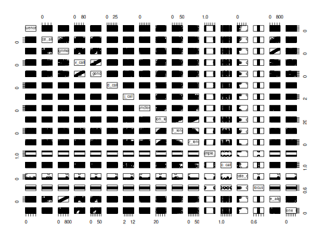

**plotCloneSummary** - *Plot clonal clustering summary*

Description
--------------------

`plotCloneSummary` plots the results in a `ScoperClones` object returned 
by `spectralClones`, `identicalClones` or `hierarchicalClones`.  
Includes the minimum inter (between) and maximum intra (within) clonal distances 
and the calculated efective threshold.


Usage
--------------------
```
plotCloneSummary(
data,
xmin = NULL,
xmax = NULL,
breaks = NULL,
binwidth = NULL,
title = NULL,
size = 0.75,
silent = FALSE,
...
)
```

Arguments
-------------------

data
:   [ScoperClones](ScoperClones-class.md) object output by the [spectralClones](spectralClones.md), 
[identicalClones](identicalClones.md) or [hierarchicalClones](hierarchicalClones.md).

xmin
:   minimum limit for plotting the x-axis. If `NULL` the limit will 
be set automatically.

xmax
:   maximum limit for plotting the x-axis. If `NULL` the limit will 
be set automatically.

breaks
:   number of breaks to show on the x-axis. If `NULL` the breaks will 
be set automatically.

binwidth
:   binwidth for the histogram. If `NULL` the binwidth 
will be set automatically.

title
:   string defining the plot title.

size
:   numeric value for lines in the plot.

silent
:   if `TRUE` do not draw the plot and just return the ggplot2 
object; if `FALSE` draw the plot.

...
:   additional arguments to pass to ggplot2::theme.


Value
-------------------

A ggplot object defining the plot.


Examples
-------------------

```R
# Find clones
results <- hierarchicalClones(ExampleDb, threshold=0.15)

```

*Running defineClonesScoper in bulk mode and only keep heavy chains*
```R

# Plot clonal summaries
plot(results, binwidth=0.02)

```

*Warning*:"binwidth" is not a graphical parameter*Warning*:"binwidth" is not a graphical parameter*Warning*:"binwidth" is not a graphical parameter*Warning*:"binwidth" is not a graphical parameter*Warning*:"binwidth" is not a graphical parameter*Warning*:"binwidth" is not a graphical parameter*Warning*:"binwidth" is not a graphical parameter*Warning*:"binwidth" is not a graphical parameter*Warning*:"binwidth" is not a graphical parameter*Warning*:"binwidth" is not a graphical parameter*Warning*:"binwidth" is not a graphical parameter*Warning*:"binwidth" is not a graphical parameter*Warning*:"binwidth" is not a graphical parameter*Warning*:"binwidth" is not a graphical parameter*Warning*:"binwidth" is not a graphical parameter*Warning*:"binwidth" is not a graphical parameter*Warning*:"binwidth" is not a graphical parameter*Warning*:"binwidth" is not a graphical parameter*Warning*:"binwidth" is not a graphical parameter*Warning*:"binwidth" is not a graphical parameter*Warning*:"binwidth" is not a graphical parameter*Warning*:"binwidth" is not a graphical parameter*Warning*:"binwidth" is not a graphical parameter*Warning*:"binwidth" is not a graphical parameter*Warning*:"binwidth" is not a graphical parameter*Warning*:"binwidth" is not a graphical parameter*Warning*:"binwidth" is not a graphical parameter*Warning*:"binwidth" is not a graphical parameter*Warning*:"binwidth" is not a graphical parameter*Warning*:"binwidth" is not a graphical parameter*Warning*:"binwidth" is not a graphical parameter*Warning*:"binwidth" is not a graphical parameter*Warning*:"binwidth" is not a graphical parameter*Warning*:"binwidth" is not a graphical parameter*Warning*:"binwidth" is not a graphical parameter*Warning*:"binwidth" is not a graphical parameter*Warning*:"binwidth" is not a graphical parameter*Warning*:"binwidth" is not a graphical parameter*Warning*:"binwidth" is not a graphical parameter*Warning*:"binwidth" is not a graphical parameter*Warning*:"binwidth" is not a graphical parameter*Warning*:"binwidth" is not a graphical parameter*Warning*:"binwidth" is not a graphical parameter*Warning*:"binwidth" is not a graphical parameter*Warning*:"binwidth" is not a graphical parameter*Warning*:"binwidth" is not a graphical parameter*Warning*:"binwidth" is not a graphical parameter*Warning*:"binwidth" is not a graphical parameter*Warning*:"binwidth" is not a graphical parameter*Warning*:"binwidth" is not a graphical parameter*Warning*:"binwidth" is not a graphical parameter*Warning*:"binwidth" is not a graphical parameter*Warning*:"binwidth" is not a graphical parameter*Warning*:"binwidth" is not a graphical parameter*Warning*:"binwidth" is not a graphical parameter*Warning*:"binwidth" is not a graphical parameter*Warning*:"binwidth" is not a graphical parameter*Warning*:"binwidth" is not a graphical parameter*Warning*:"binwidth" is not a graphical parameter*Warning*:"binwidth" is not a graphical parameter*Warning*:"binwidth" is not a graphical parameter*Warning*:"binwidth" is not a graphical parameter*Warning*:"binwidth" is not a graphical parameter*Warning*:"binwidth" is not a graphical parameter*Warning*:"binwidth" is not a graphical parameter*Warning*:"binwidth" is not a graphical parameter*Warning*:"binwidth" is not a graphical parameter*Warning*:"binwidth" is not a graphical parameter*Warning*:"binwidth" is not a graphical parameter*Warning*:"binwidth" is not a graphical parameter*Warning*:"binwidth" is not a graphical parameter*Warning*:"binwidth" is not a graphical parameter*Warning*:"binwidth" is not a graphical parameter*Warning*:"binwidth" is not a graphical parameter*Warning*:"binwidth" is not a graphical parameter*Warning*:"binwidth" is not a graphical parameter*Warning*:"binwidth" is not a graphical parameter*Warning*:"binwidth" is not a graphical parameter*Warning*:"binwidth" is not a graphical parameter*Warning*:"binwidth" is not a graphical parameter*Warning*:"binwidth" is not a graphical parameter*Warning*:"binwidth" is not a graphical parameter*Warning*:"binwidth" is not a graphical parameter*Warning*:"binwidth" is not a graphical parameter*Warning*:"binwidth" is not a graphical parameter*Warning*:"binwidth" is not a graphical parameter*Warning*:"binwidth" is not a graphical parameter*Warning*:"binwidth" is not a graphical parameter*Warning*:"binwidth" is not a graphical parameter*Warning*:"binwidth" is not a graphical parameter*Warning*:"binwidth" is not a graphical parameter*Warning*:"binwidth" is not a graphical parameter*Warning*:"binwidth" is not a graphical parameter*Warning*:"binwidth" is not a graphical parameter*Warning*:"binwidth" is not a graphical parameter*Warning*:"binwidth" is not a graphical parameter*Warning*:"binwidth" is not a graphical parameter*Warning*:"binwidth" is not a graphical parameter*Warning*:"binwidth" is not a graphical parameter*Warning*:"binwidth" is not a graphical parameter*Warning*:"binwidth" is not a graphical parameter*Warning*:"binwidth" is not a graphical parameter*Warning*:"binwidth" is not a graphical parameter*Warning*:"binwidth" is not a graphical parameter*Warning*:"binwidth" is not a graphical parameter*Warning*:"binwidth" is not a graphical parameter*Warning*:"binwidth" is not a graphical parameter*Warning*:"binwidth" is not a graphical parameter*Warning*:"binwidth" is not a graphical parameter*Warning*:"binwidth" is not a graphical parameter*Warning*:"binwidth" is not a graphical parameter*Warning*:"binwidth" is not a graphical parameter*Warning*:"binwidth" is not a graphical parameter*Warning*:"binwidth" is not a graphical parameter*Warning*:"binwidth" is not a graphical parameter*Warning*:"binwidth" is not a graphical parameter*Warning*:"binwidth" is not a graphical parameter*Warning*:"binwidth" is not a graphical parameter*Warning*:"binwidth" is not a graphical parameter*Warning*:"binwidth" is not a graphical parameter*Warning*:"binwidth" is not a graphical parameter*Warning*:"binwidth" is not a graphical parameter*Warning*:"binwidth" is not a graphical parameter*Warning*:"binwidth" is not a graphical parameter*Warning*:"binwidth" is not a graphical parameter*Warning*:"binwidth" is not a graphical parameter*Warning*:"binwidth" is not a graphical parameter*Warning*:"binwidth" is not a graphical parameter*Warning*:"binwidth" is not a graphical parameter*Warning*:"binwidth" is not a graphical parameter*Warning*:"binwidth" is not a graphical parameter*Warning*:"binwidth" is not a graphical parameter*Warning*:"binwidth" is not a graphical parameter*Warning*:"binwidth" is not a graphical parameter*Warning*:"binwidth" is not a graphical parameter*Warning*:"binwidth" is not a graphical parameter*Warning*:"binwidth" is not a graphical parameter*Warning*:"binwidth" is not a graphical parameter*Warning*:"binwidth" is not a graphical parameter*Warning*:"binwidth" is not a graphical parameter*Warning*:"binwidth" is not a graphical parameter*Warning*:"binwidth" is not a graphical parameter*Warning*:"binwidth" is not a graphical parameter*Warning*:"binwidth" is not a graphical parameter*Warning*:"binwidth" is not a graphical parameter*Warning*:"binwidth" is not a graphical parameter*Warning*:"binwidth" is not a graphical parameter*Warning*:"binwidth" is not a graphical parameter*Warning*:"binwidth" is not a graphical parameter*Warning*:"binwidth" is not a graphical parameter*Warning*:"binwidth" is not a graphical parameter*Warning*:"binwidth" is not a graphical parameter*Warning*:"binwidth" is not a graphical parameter*Warning*:"binwidth" is not a graphical parameter*Warning*:"binwidth" is not a graphical parameter*Warning*:"binwidth" is not a graphical parameter*Warning*:"binwidth" is not a graphical parameter*Warning*:"binwidth" is not a graphical parameter*Warning*:"binwidth" is not a graphical parameter*Warning*:"binwidth" is not a graphical parameter*Warning*:"binwidth" is not a graphical parameter*Warning*:"binwidth" is not a graphical parameter*Warning*:"binwidth" is not a graphical parameter*Warning*:"binwidth" is not a graphical parameter*Warning*:"binwidth" is not a graphical parameter*Warning*:"binwidth" is not a graphical parameter*Warning*:"binwidth" is not a graphical parameter*Warning*:"binwidth" is not a graphical parameter*Warning*:"binwidth" is not a graphical parameter*Warning*:"binwidth" is not a graphical parameter*Warning*:"binwidth" is not a graphical parameter*Warning*:"binwidth" is not a graphical parameter*Warning*:"binwidth" is not a graphical parameter*Warning*:"binwidth" is not a graphical parameter*Warning*:"binwidth" is not a graphical parameter*Warning*:"binwidth" is not a graphical parameter*Warning*:"binwidth" is not a graphical parameter*Warning*:"binwidth" is not a graphical parameter*Warning*:"binwidth" is not a graphical parameter*Warning*:"binwidth" is not a graphical parameter*Warning*:"binwidth" is not a graphical parameter*Warning*:"binwidth" is not a graphical parameter*Warning*:"binwidth" is not a graphical parameter*Warning*:"binwidth" is not a graphical parameter*Warning*:"binwidth" is not a graphical parameter*Warning*:"binwidth" is not a graphical parameter*Warning*:"binwidth" is not a graphical parameter*Warning*:"binwidth" is not a graphical parameter*Warning*:"binwidth" is not a graphical parameter*Warning*:"binwidth" is not a graphical parameter*Warning*:"binwidth" is not a graphical parameter*Warning*:"binwidth" is not a graphical parameter*Warning*:"binwidth" is not a graphical parameter*Warning*:"binwidth" is not a graphical parameter*Warning*:"binwidth" is not a graphical parameter*Warning*:"binwidth" is not a graphical parameter*Warning*:"binwidth" is not a graphical parameter*Warning*:"binwidth" is not a graphical parameter*Warning*:"binwidth" is not a graphical parameter*Warning*:"binwidth" is not a graphical parameter*Warning*:"binwidth" is not a graphical parameter*Warning*:"binwidth" is not a graphical parameter*Warning*:"binwidth" is not a graphical parameter*Warning*:"binwidth" is not a graphical parameter*Warning*:"binwidth" is not a graphical parameter*Warning*:"binwidth" is not a graphical parameter*Warning*:"binwidth" is not a graphical parameter*Warning*:"binwidth" is not a graphical parameter*Warning*:"binwidth" is not a graphical parameter*Warning*:"binwidth" is not a graphical parameter*Warning*:"binwidth" is not a graphical parameter*Warning*:"binwidth" is not a graphical parameter*Warning*:"binwidth" is not a graphical parameter*Warning*:"binwidth" is not a graphical parameter*Warning*:"binwidth" is not a graphical parameter*Warning*:"binwidth" is not a graphical parameter*Warning*:"binwidth" is not a graphical parameter*Warning*:"binwidth" is not a graphical parameter*Warning*:"binwidth" is not a graphical parameter*Warning*:"binwidth" is not a graphical parameter*Warning*:"binwidth" is not a graphical parameter*Warning*:"binwidth" is not a graphical parameter*Warning*:"binwidth" is not a graphical parameter*Warning*:"binwidth" is not a graphical parameter*Warning*:"binwidth" is not a graphical parameter*Warning*:"binwidth" is not a graphical parameter*Warning*:"binwidth" is not a graphical parameter*Warning*:"binwidth" is not a graphical parameter*Warning*:"binwidth" is not a graphical parameter*Warning*:"binwidth" is not a graphical parameter*Warning*:"binwidth" is not a graphical parameter*Warning*:"binwidth" is not a graphical parameter*Warning*:"binwidth" is not a graphical parameter*Warning*:"binwidth" is not a graphical parameter*Warning*:"binwidth" is not a graphical parameter*Warning*:"binwidth" is not a graphical parameter*Warning*:"binwidth" is not a graphical parameter*Warning*:"binwidth" is not a graphical parameter*Warning*:"binwidth" is not a graphical parameter*Warning*:"binwidth" is not a graphical parameter*Warning*:"binwidth" is not a graphical parameter*Warning*:"binwidth" is not a graphical parameter*Warning*:"binwidth" is not a graphical parameter*Warning*:"binwidth" is not a graphical parameter*Warning*:"binwidth" is not a graphical parameter*Warning*:"binwidth" is not a graphical parameter*Warning*:"binwidth" is not a graphical parameter*Warning*:"binwidth" is not a graphical parameter*Warning*:"binwidth" is not a graphical parameter*Warning*:"binwidth" is not a graphical parameter*Warning*:"binwidth" is not a graphical parameter*Warning*:"binwidth" is not a graphical parameter*Warning*:"binwidth" is not a graphical parameter*Warning*:"binwidth" is not a graphical parameter*Warning*:"binwidth" is not a graphical parameter*Warning*:"binwidth" is not a graphical parameter*Warning*:"binwidth" is not a graphical parameter*Warning*:"binwidth" is not a graphical parameter*Warning*:"binwidth" is not a graphical parameter*Warning*:"binwidth" is not a graphical parameter*Warning*:"binwidth" is not a graphical parameter*Warning*:"binwidth" is not a graphical parameter*Warning*:"binwidth" is not a graphical parameter*Warning*:"binwidth" is not a graphical parameter*Warning*:"binwidth" is not a graphical parameter*Warning*:"binwidth" is not a graphical parameter*Warning*:"binwidth" is not a graphical parameter*Warning*:"binwidth" is not a graphical parameter*Warning*:"binwidth" is not a graphical parameter*Warning*:"binwidth" is not a graphical parameter*Warning*:"binwidth" is not a graphical parameter*Warning*:"binwidth" is not a graphical parameter*Warning*:"binwidth" is not a graphical parameter*Warning*:"binwidth" is not a graphical parameter*Warning*:"binwidth" is not a graphical parameter*Warning*:"binwidth" is not a graphical parameter*Warning*:"binwidth" is not a graphical parameter*Warning*:"binwidth" is not a graphical parameter*Warning*:"binwidth" is not a graphical parameter*Warning*:"binwidth" is not a graphical parameter*Warning*:"binwidth" is not a graphical parameter*Warning*:"binwidth" is not a graphical parameter*Warning*:"binwidth" is not a graphical parameter*Warning*:"binwidth" is not a graphical parameter*Warning*:"binwidth" is not a graphical parameter*Warning*:"binwidth" is not a graphical parameter*Warning*:"binwidth" is not a graphical parameter*Warning*:"binwidth" is not a graphical parameter*Warning*:"binwidth" is not a graphical parameter*Warning*:"binwidth" is not a graphical parameter*Warning*:"binwidth" is not a graphical parameter*Warning*:"binwidth" is not a graphical parameter*Warning*:"binwidth" is not a graphical parameter*Warning*:"binwidth" is not a graphical parameter*Warning*:"binwidth" is not a graphical parameter*Warning*:"binwidth" is not a graphical parameter*Warning*:"binwidth" is not a graphical parameter*Warning*:"binwidth" is not a graphical parameter*Warning*:"binwidth" is not a graphical parameter*Warning*:"binwidth" is not a graphical parameter*Warning*:"binwidth" is not a graphical parameter*Warning*:"binwidth" is not a graphical parameter*Warning*:"binwidth" is not a graphical parameter*Warning*:"binwidth" is not a graphical parameter*Warning*:"binwidth" is not a graphical parameter*Warning*:"binwidth" is not a graphical parameter*Warning*:"binwidth" is not a graphical parameter*Warning*:"binwidth" is not a graphical parameter*Warning*:"binwidth" is not a graphical parameter*Warning*:"binwidth" is not a graphical parameter*Warning*:"binwidth" is not a graphical parameter*Warning*:"binwidth" is not a graphical parameter*Warning*:"binwidth" is not a graphical parameter*Warning*:"binwidth" is not a graphical parameter*Warning*:"binwidth" is not a graphical parameter*Warning*:"binwidth" is not a graphical parameter*Warning*:"binwidth" is not a graphical parameter*Warning*:"binwidth" is not a graphical parameter*Warning*:"binwidth" is not a graphical parameter*Warning*:"binwidth" is not a graphical parameter*Warning*:"binwidth" is not a graphical parameter*Warning*:"binwidth" is not a graphical parameter*Warning*:"binwidth" is not a graphical parameter*Warning*:"binwidth" is not a graphical parameter*Warning*:"binwidth" is not a graphical parameter*Warning*:"binwidth" is not a graphical parameter*Warning*:"binwidth" is not a graphical parameter*Warning*:"binwidth" is not a graphical parameter*Warning*:"binwidth" is not a graphical parameter*Warning*:"binwidth" is not a graphical parameter*Warning*:"binwidth" is not a graphical parameter*Warning*:"binwidth" is not a graphical parameter*Warning*:"binwidth" is not a graphical parameter*Warning*:"binwidth" is not a graphical parameter*Warning*:"binwidth" is not a graphical parameter*Warning*:"binwidth" is not a graphical parameter*Warning*:"binwidth" is not a graphical parameter*Warning*:"binwidth" is not a graphical parameter*Warning*:"binwidth" is not a graphical parameter*Warning*:"binwidth" is not a graphical parameter*Warning*:"binwidth" is not a graphical parameter*Warning*:"binwidth" is not a graphical parameter*Warning*:"binwidth" is not a graphical parameter*Warning*:"binwidth" is not a graphical parameter*Warning*:"binwidth" is not a graphical parameter*Warning*:"binwidth" is not a graphical parameter*Warning*:"binwidth" is not a graphical parameter*Warning*:"binwidth" is not a graphical parameter*Warning*:"binwidth" is not a graphical parameter*Warning*:"binwidth" is not a graphical parameter*Warning*:"binwidth" is not a graphical parameter*Warning*:"binwidth" is not a graphical parameter*Warning*:"binwidth" is not a graphical parameter*Warning*:"binwidth" is not a graphical parameter*Warning*:"binwidth" is not a graphical parameter*Warning*:"binwidth" is not a graphical parameter*Warning*:"binwidth" is not a graphical parameter*Warning*:"binwidth" is not a graphical parameter*Warning*:"binwidth" is not a graphical parameter*Warning*:"binwidth" is not a graphical parameter*Warning*:"binwidth" is not a graphical parameter*Warning*:"binwidth" is not a graphical parameter*Warning*:"binwidth" is not a graphical parameter*Warning*:"binwidth" is not a graphical parameter*Warning*:"binwidth" is not a graphical parameter*Warning*:"binwidth" is not a graphical parameter*Warning*:"binwidth" is not a graphical parameter*Warning*:"binwidth" is not a graphical parameter*Warning*:"binwidth" is not a graphical parameter*Warning*:"binwidth" is not a graphical parameter*Warning*:"binwidth" is not a graphical parameter*Warning*:"binwidth" is not a graphical parameter*Warning*:"binwidth" is not a graphical parameter*Warning*:"binwidth" is not a graphical parameter*Warning*:"binwidth" is not a graphical parameter*Warning*:"binwidth" is not a graphical parameter*Warning*:"binwidth" is not a graphical parameter*Warning*:"binwidth" is not a graphical parameter*Warning*:"binwidth" is not a graphical parameter*Warning*:"binwidth" is not a graphical parameter*Warning*:"binwidth" is not a graphical parameter*Warning*:"binwidth" is not a graphical parameter*Warning*:"binwidth" is not a graphical parameter*Warning*:"binwidth" is not a graphical parameter*Warning*:"binwidth" is not a graphical parameter*Warning*:"binwidth" is not a graphical parameter*Warning*:"binwidth" is not a graphical parameter*Warning*:"binwidth" is not a graphical parameter*Warning*:"binwidth" is not a graphical parameter*Warning*:"binwidth" is not a graphical parameter*Warning*:"binwidth" is not a graphical parameter*Warning*:"binwidth" is not a graphical parameter*Warning*:"binwidth" is not a graphical parameter*Warning*:"binwidth" is not a graphical parameter*Warning*:"binwidth" is not a graphical parameter*Warning*:"binwidth" is not a graphical parameter*Warning*:"binwidth" is not a graphical parameter*Warning*:"binwidth" is not a graphical parameter*Warning*:"binwidth" is not a graphical parameter*Warning*:"binwidth" is not a graphical parameter*Warning*:"binwidth" is not a graphical parameter*Warning*:"binwidth" is not a graphical parameter*Warning*:"binwidth" is not a graphical parameter*Warning*:"binwidth" is not a graphical parameter*Warning*:"binwidth" is not a graphical parameter*Warning*:"binwidth" is not a graphical parameter*Warning*:"binwidth" is not a graphical parameter*Warning*:"binwidth" is not a graphical parameter*Warning*:"binwidth" is not a graphical parameter*Warning*:"binwidth" is not a graphical parameter*Warning*:"binwidth" is not a graphical parameter*Warning*:"binwidth" is not a graphical parameter*Warning*:"binwidth" is not a graphical parameter*Warning*:"binwidth" is not a graphical parameter*Warning*:"binwidth" is not a graphical parameter*Warning*:"binwidth" is not a graphical parameter*Warning*:"binwidth" is not a graphical parameter*Warning*:"binwidth" is not a graphical parameter*Warning*:"binwidth" is not a graphical parameter*Warning*:"binwidth" is not a graphical parameter*Warning*:"binwidth" is not a graphical parameter*Warning*:"binwidth" is not a graphical parameter*Warning*:"binwidth" is not a graphical parameter*Warning*:"binwidth" is not a graphical parameter*Warning*:"binwidth" is not a graphical parameter*Warning*:"binwidth" is not a graphical parameter*Warning*:"binwidth" is not a graphical parameter*Warning*:"binwidth" is not a graphical parameter*Warning*:"binwidth" is not a graphical parameter*Warning*:"binwidth" is not a graphical parameter*Warning*:"binwidth" is not a graphical parameter*Warning*:"binwidth" is not a graphical parameter*Warning*:"binwidth" is not a graphical parameter*Warning*:"binwidth" is not a graphical parameter*Warning*:"binwidth" is not a graphical parameter*Warning*:"binwidth" is not a graphical parameter*Warning*:"binwidth" is not a graphical parameter*Warning*:"binwidth" is not a graphical parameter*Warning*:"binwidth" is not a graphical parameter*Warning*:"binwidth" is not a graphical parameter*Warning*:"binwidth" is not a graphical parameter*Warning*:"binwidth" is not a graphical parameter*Warning*:"binwidth" is not a graphical parameter*Warning*:"binwidth" is not a graphical parameter*Warning*:"binwidth" is not a graphical parameter*Warning*:"binwidth" is not a graphical parameter*Warning*:"binwidth" is not a graphical parameter*Warning*:"binwidth" is not a graphical parameter*Warning*:"binwidth" is not a graphical parameter*Warning*:"binwidth" is not a graphical parameter*Warning*:"binwidth" is not a graphical parameter*Warning*:"binwidth" is not a graphical parameter*Warning*:"binwidth" is not a graphical parameter*Warning*:"binwidth" is not a graphical parameter*Warning*:"binwidth" is not a graphical parameter*Warning*:"binwidth" is not a graphical parameter*Warning*:"binwidth" is not a graphical parameter*Warning*:"binwidth" is not a graphical parameter*Warning*:"binwidth" is not a graphical parameter*Warning*:"binwidth" is not a graphical parameter*Warning*:"binwidth" is not a graphical parameter*Warning*:"binwidth" is not a graphical parameter*Warning*:"binwidth" is not a graphical parameter*Warning*:"binwidth" is not a graphical parameter*Warning*:"binwidth" is not a graphical parameter*Warning*:"binwidth" is not a graphical parameter*Warning*:"binwidth" is not a graphical parameter*Warning*:"binwidth" is not a graphical parameter*Warning*:"binwidth" is not a graphical parameter*Warning*:"binwidth" is not a graphical parameter*Warning*:"binwidth" is not a graphical parameter*Warning*:"binwidth" is not a graphical parameter*Warning*:"binwidth" is not a graphical parameter*Warning*:"binwidth" is not a graphical parameter*Warning*:"binwidth" is not a graphical parameter*Warning*:"binwidth" is not a graphical parameter*Warning*:"binwidth" is not a graphical parameter*Warning*:"binwidth" is not a graphical parameter*Warning*:"binwidth" is not a graphical parameter*Warning*:"binwidth" is not a graphical parameter*Warning*:"binwidth" is not a graphical parameter*Warning*:"binwidth" is not a graphical parameter*Warning*:"binwidth" is not a graphical parameter*Warning*:"binwidth" is not a graphical parameter*Warning*:"binwidth" is not a graphical parameter*Warning*:"binwidth" is not a graphical parameter*Warning*:"binwidth" is not a graphical parameter*Warning*:"binwidth" is not a graphical parameter*Warning*:"binwidth" is not a graphical parameter*Warning*:"binwidth" is not a graphical parameter*Warning*:"binwidth" is not a graphical parameter*Warning*:"binwidth" is not a graphical parameter*Warning*:"binwidth" is not a graphical parameter*Warning*:"binwidth" is not a graphical parameter*Warning*:"binwidth" is not a graphical parameter*Warning*:"binwidth" is not a graphical parameter*Warning*:"binwidth" is not a graphical parameter*Warning*:"binwidth" is not a graphical parameter*Warning*:"binwidth" is not a graphical parameter*Warning*:"binwidth" is not a graphical parameter*Warning*:"binwidth" is not a graphical parameter*Warning*:"binwidth" is not a graphical parameter*Warning*:"binwidth" is not a graphical parameter*Warning*:"binwidth" is not a graphical parameter*Warning*:"binwidth" is not a graphical parameter*Warning*:"binwidth" is not a graphical parameter*Warning*:"binwidth" is not a graphical parameter*Warning*:"binwidth" is not a graphical parameter*Warning*:"binwidth" is not a graphical parameter*Warning*:"binwidth" is not a graphical parameter*Warning*:"binwidth" is not a graphical parameter*Warning*:"binwidth" is not a graphical parameter*Warning*:"binwidth" is not a graphical parameter*Warning*:"binwidth" is not a graphical parameter*Warning*:"binwidth" is not a graphical parameter*Warning*:"binwidth" is not a graphical parameter*Warning*:"binwidth" is not a graphical parameter*Warning*:"binwidth" is not a graphical parameter*Warning*:"binwidth" is not a graphical parameter*Warning*:"binwidth" is not a graphical parameter*Warning*:"binwidth" is not a graphical parameter*Warning*:"binwidth" is not a graphical parameter*Warning*:"binwidth" is not a graphical parameter*Warning*:"binwidth" is not a graphical parameter*Warning*:"binwidth" is not a graphical parameter*Warning*:"binwidth" is not a graphical parameter*Warning*:"binwidth" is not a graphical parameter*Warning*:"binwidth" is not a graphical parameter*Warning*:"binwidth" is not a graphical parameter*Warning*:"binwidth" is not a graphical parameter*Warning*:"binwidth" is not a graphical parameter*Warning*:"binwidth" is not a graphical parameter*Warning*:"binwidth" is not a graphical parameter*Warning*:"binwidth" is not a graphical parameter*Warning*:"binwidth" is not a graphical parameter*Warning*:"binwidth" is not a graphical parameter*Warning*:"binwidth" is not a graphical parameter*Warning*:"binwidth" is not a graphical parameter*Warning*:"binwidth" is not a graphical parameter*Warning*:"binwidth" is not a graphical parameter*Warning*:"binwidth" is not a graphical parameter*Warning*:"binwidth" is not a graphical parameter*Warning*:"binwidth" is not a graphical parameter*Warning*:"binwidth" is not a graphical parameter*Warning*:"binwidth" is not a graphical parameter*Warning*:"binwidth" is not a graphical parameter*Warning*:"binwidth" is not a graphical parameter*Warning*:"binwidth" is not a graphical parameter*Warning*:"binwidth" is not a graphical parameter*Warning*:"binwidth" is not a graphical parameter*Warning*:"binwidth" is not a graphical parameter*Warning*:"binwidth" is not a graphical parameter*Warning*:"binwidth" is not a graphical parameter*Warning*:"binwidth" is not a graphical parameter*Warning*:"binwidth" is not a graphical parameter*Warning*:"binwidth" is not a graphical parameter*Warning*:"binwidth" is not a graphical parameter*Warning*:"binwidth" is not a graphical parameter*Warning*:"binwidth" is not a graphical parameter*Warning*:"binwidth" is not a graphical parameter*Warning*:"binwidth" is not a graphical parameter*Warning*:"binwidth" is not a graphical parameter*Warning*:"binwidth" is not a graphical parameter*Warning*:"binwidth" is not a graphical parameter*Warning*:"binwidth" is not a graphical parameter*Warning*:"binwidth" is not a graphical parameter*Warning*:"binwidth" is not a graphical parameter*Warning*:"binwidth" is not a graphical parameter*Warning*:"binwidth" is not a graphical parameter*Warning*:"binwidth" is not a graphical parameter*Warning*:"binwidth" is not a graphical parameter*Warning*:"binwidth" is not a graphical parameter*Warning*:"binwidth" is not a graphical parameter*Warning*:"binwidth" is not a graphical parameter*Warning*:"binwidth" is not a graphical parameter*Warning*:"binwidth" is not a graphical parameter*Warning*:"binwidth" is not a graphical parameter*Warning*:"binwidth" is not a graphical parameter*Warning*:"binwidth" is not a graphical parameter*Warning*:"binwidth" is not a graphical parameter*Warning*:"binwidth" is not a graphical parameter*Warning*:"binwidth" is not a graphical parameter*Warning*:"binwidth" is not a graphical parameter*Warning*:"binwidth" is not a graphical parameter*Warning*:"binwidth" is not a graphical parameter*Warning*:"binwidth" is not a graphical parameter*Warning*:"binwidth" is not a graphical parameter*Warning*:"binwidth" is not a graphical parameter*Warning*:"binwidth" is not a graphical parameter*Warning*:"binwidth" is not a graphical parameter*Warning*:"binwidth" is not a graphical parameter*Warning*:"binwidth" is not a graphical parameter*Warning*:"binwidth" is not a graphical parameter*Warning*:"binwidth" is not a graphical parameter*Warning*:"binwidth" is not a graphical parameter*Warning*:"binwidth" is not a graphical parameter*Warning*:"binwidth" is not a graphical parameter*Warning*:"binwidth" is not a graphical parameter*Warning*:"binwidth" is not a graphical parameter*Warning*:"binwidth" is not a graphical parameter*Warning*:"binwidth" is not a graphical parameter*Warning*:"binwidth" is not a graphical parameter*Warning*:"binwidth" is not a graphical parameter*Warning*:"binwidth" is not a graphical parameter*Warning*:"binwidth" is not a graphical parameter*Warning*:"binwidth" is not a graphical parameter*Warning*:"binwidth" is not a graphical parameter*Warning*:"binwidth" is not a graphical parameter*Warning*:"binwidth" is not a graphical parameter*Warning*:"binwidth" is not a graphical parameter*Warning*:"binwidth" is not a graphical parameter*Warning*:"binwidth" is not a graphical parameter*Warning*:"binwidth" is not a graphical parameter*Warning*:"binwidth" is not a graphical parameter*Warning*:"binwidth" is not a graphical parameter*Warning*:"binwidth" is not a graphical parameter*Warning*:"binwidth" is not a graphical parameter*Warning*:"binwidth" is not a graphical parameter*Warning*:"binwidth" is not a graphical parameter*Warning*:"binwidth" is not a graphical parameter*Warning*:"binwidth" is not a graphical parameter*Warning*:"binwidth" is not a graphical parameter*Warning*:"binwidth" is not a graphical parameter*Warning*:"binwidth" is not a graphical parameter*Warning*:"binwidth" is not a graphical parameter*Warning*:"binwidth" is not a graphical parameter*Warning*:"binwidth" is not a graphical parameter*Warning*:"binwidth" is not a graphical parameter*Warning*:"binwidth" is not a graphical parameter*Warning*:"binwidth" is not a graphical parameter*Warning*:"binwidth" is not a graphical parameter*Warning*:"binwidth" is not a graphical parameter*Warning*:"binwidth" is not a graphical parameter*Warning*:"binwidth" is not a graphical parameter*Warning*:"binwidth" is not a graphical parameter*Warning*:"binwidth" is not a graphical parameter*Warning*:"binwidth" is not a graphical parameter*Warning*:"binwidth" is not a graphical parameter*Warning*:"binwidth" is not a graphical parameter*Warning*:"binwidth" is not a graphical parameter*Warning*:"binwidth" is not a graphical parameter*Warning*:"binwidth" is not a graphical parameter*Warning*:"binwidth" is not a graphical parameter*Warning*:"binwidth" is not a graphical parameter*Warning*:"binwidth" is not a graphical parameter*Warning*:"binwidth" is not a graphical parameter*Warning*:"binwidth" is not a graphical parameter*Warning*:"binwidth" is not a graphical parameter*Warning*:"binwidth" is not a graphical parameter*Warning*:"binwidth" is not a graphical parameter*Warning*:"binwidth" is not a graphical parameter*Warning*:"binwidth" is not a graphical parameter*Warning*:"binwidth" is not a graphical parameter*Warning*:"binwidth" is not a graphical parameter*Warning*:"binwidth" is not a graphical parameter*Warning*:"binwidth" is not a graphical parameter*Warning*:"binwidth" is not a graphical parameter*Warning*:"binwidth" is not a graphical parameter*Warning*:"binwidth" is not a graphical parameter*Warning*:"binwidth" is not a graphical parameter*Warning*:"binwidth" is not a graphical parameter*Warning*:"binwidth" is not a graphical parameter*Warning*:"binwidth" is not a graphical parameter*Warning*:"binwidth" is not a graphical parameter*Warning*:"binwidth" is not a graphical parameter*Warning*:"binwidth" is not a graphical parameter*Warning*:"binwidth" is not a graphical parameter*Warning*:"binwidth" is not a graphical parameter*Warning*:"binwidth" is not a graphical parameter*Warning*:"binwidth" is not a graphical parameter*Warning*:"binwidth" is not a graphical parameter*Warning*:"binwidth" is not a graphical parameter*Warning*:"binwidth" is not a graphical parameter*Warning*:"binwidth" is not a graphical parameter*Warning*:"binwidth" is not a graphical parameter*Warning*:"binwidth" is not a graphical parameter*Warning*:"binwidth" is not a graphical parameter*Warning*:"binwidth" is not a graphical parameter*Warning*:"binwidth" is not a graphical parameter*Warning*:"binwidth" is not a graphical parameter*Warning*:"binwidth" is not a graphical parameter*Warning*:"binwidth" is not a graphical parameter*Warning*:"binwidth" is not a graphical parameter*Warning*:"binwidth" is not a graphical parameter*Warning*:"binwidth" is not a graphical parameter*Warning*:"binwidth" is not a graphical parameter*Warning*:"binwidth" is not a graphical parameter*Warning*:"binwidth" is not a graphical parameter*Warning*:"binwidth" is not a graphical parameter*Warning*:"binwidth" is not a graphical parameter*Warning*:"binwidth" is not a graphical parameter*Warning*:"binwidth" is not a graphical parameter*Warning*:"binwidth" is not a graphical parameter*Warning*:"binwidth" is not a graphical parameter*Warning*:"binwidth" is not a graphical parameter*Warning*:"binwidth" is not a graphical parameter*Warning*:"binwidth" is not a graphical parameter*Warning*:"binwidth" is not a graphical parameter*Warning*:"binwidth" is not a graphical parameter*Warning*:"binwidth" is not a graphical parameter*Warning*:"binwidth" is not a graphical parameter*Warning*:"binwidth" is not a graphical parameter*Warning*:"binwidth" is not a graphical parameter*Warning*:"binwidth" is not a graphical parameter*Warning*:"binwidth" is not a graphical parameter*Warning*:"binwidth" is not a graphical parameter*Warning*:"binwidth" is not a graphical parameter*Warning*:"binwidth" is not a graphical parameter*Warning*:"binwidth" is not a graphical parameter*Warning*:"binwidth" is not a graphical parameter*Warning*:"binwidth" is not a graphical parameter*Warning*:"binwidth" is not a graphical parameter*Warning*:"binwidth" is not a graphical parameter*Warning*:"binwidth" is not a graphical parameter*Warning*:"binwidth" is not a graphical parameter*Warning*:"binwidth" is not a graphical parameter*Warning*:"binwidth" is not a graphical parameter*Warning*:"binwidth" is not a graphical parameter*Warning*:"binwidth" is not a graphical parameter*Warning*:"binwidth" is not a graphical parameter*Warning*:"binwidth" is not a graphical parameter*Warning*:"binwidth" is not a graphical parameter*Warning*:"binwidth" is not a graphical parameter*Warning*:"binwidth" is not a graphical parameter*Warning*:"binwidth" is not a graphical parameter*Warning*:"binwidth" is not a graphical parameter*Warning*:"binwidth" is not a graphical parameter*Warning*:"binwidth" is not a graphical parameter*Warning*:"binwidth" is not a graphical parameter*Warning*:"binwidth" is not a graphical parameter*Warning*:"binwidth" is not a graphical parameter*Warning*:"binwidth" is not a graphical parameter*Warning*:"binwidth" is not a graphical parameter*Warning*:"binwidth" is not a graphical parameter*Warning*:"binwidth" is not a graphical parameter*Warning*:"binwidth" is not a graphical parameter*Warning*:"binwidth" is not a graphical parameter*Warning*:"binwidth" is not a graphical parameter*Warning*:"binwidth" is not a graphical parameter*Warning*:"binwidth" is not a graphical parameter*Warning*:"binwidth" is not a graphical parameter*Warning*:"binwidth" is not a graphical parameter*Warning*:"binwidth" is not a graphical parameter*Warning*:"binwidth" is not a graphical parameter*Warning*:"binwidth" is not a graphical parameter*Warning*:"binwidth" is not a graphical parameter*Warning*:"binwidth" is not a graphical parameter*Warning*:"binwidth" is not a graphical parameter*Warning*:"binwidth" is not a graphical parameter*Warning*:"binwidth" is not a graphical parameter*Warning*:"binwidth" is not a graphical parameter*Warning*:"binwidth" is not a graphical parameter*Warning*:"binwidth" is not a graphical parameter*Warning*:"binwidth" is not a graphical parameter*Warning*:"binwidth" is not a graphical parameter*Warning*:"binwidth" is not a graphical parameter*Warning*:"binwidth" is not a graphical parameter*Warning*:"binwidth" is not a graphical parameter*Warning*:"binwidth" is not a graphical parameter*Warning*:"binwidth" is not a graphical parameter*Warning*:"binwidth" is not a graphical parameter*Warning*:"binwidth" is not a graphical parameter*Warning*:"binwidth" is not a graphical parameter*Warning*:"binwidth" is not a graphical parameter*Warning*:"binwidth" is not a graphical parameter*Warning*:"binwidth" is not a graphical parameter*Warning*:"binwidth" is not a graphical parameter*Warning*:"binwidth" is not a graphical parameter*Warning*:"binwidth" is not a graphical parameter*Warning*:"binwidth" is not a graphical parameter*Warning*:"binwidth" is not a graphical parameter*Warning*:"binwidth" is not a graphical parameter*Warning*:"binwidth" is not a graphical parameter*Warning*:"binwidth" is not a graphical parameter*Warning*:"binwidth" is not a graphical parameter*Warning*:"binwidth" is not a graphical parameter*Warning*:"binwidth" is not a graphical parameter*Warning*:"binwidth" is not a graphical parameter*Warning*:"binwidth" is not a graphical parameter*Warning*:"binwidth" is not a graphical parameter*Warning*:"binwidth" is not a graphical parameter*Warning*:"binwidth" is not a graphical parameter*Warning*:"binwidth" is not a graphical parameter*Warning*:"binwidth" is not a graphical parameter*Warning*:"binwidth" is not a graphical parameter*Warning*:"binwidth" is not a graphical parameter*Warning*:"binwidth" is not a graphical parameter*Warning*:"binwidth" is not a graphical parameter*Warning*:"binwidth" is not a graphical parameter*Warning*:"binwidth" is not a graphical parameter*Warning*:"binwidth" is not a graphical parameter*Warning*:"binwidth" is not a graphical parameter*Warning*:"binwidth" is not a graphical parameter*Warning*:"binwidth" is not a graphical parameter*Warning*:"binwidth" is not a graphical parameter*Warning*:"binwidth" is not a graphical parameter*Warning*:"binwidth" is not a graphical parameter*Warning*:"binwidth" is not a graphical parameter*Warning*:"binwidth" is not a graphical parameter*Warning*:"binwidth" is not a graphical parameter*Warning*:"binwidth" is not a graphical parameter*Warning*:"binwidth" is not a graphical parameter*Warning*:"binwidth" is not a graphical parameter*Warning*:"binwidth" is not a graphical parameter*Warning*:"binwidth" is not a graphical parameter*Warning*:"binwidth" is not a graphical parameter*Warning*:"binwidth" is not a graphical parameter*Warning*:"binwidth" is not a graphical parameter*Warning*:"binwidth" is not a graphical parameter*Warning*:"binwidth" is not a graphical parameter*Warning*:"binwidth" is not a graphical parameter*Warning*:"binwidth" is not a graphical parameter*Warning*:"binwidth" is not a graphical parameter*Warning*:"binwidth" is not a graphical parameter*Warning*:"binwidth" is not a graphical parameter*Warning*:"binwidth" is not a graphical parameter*Warning*:"binwidth" is not a graphical parameter*Warning*:"binwidth" is not a graphical parameter*Warning*:"binwidth" is not a graphical parameter*Warning*:"binwidth" is not a graphical parameter*Warning*:"binwidth" is not a graphical parameter*Warning*:"binwidth" is not a graphical parameter*Warning*:"binwidth" is not a graphical parameter*Warning*:"binwidth" is not a graphical parameter*Warning*:"binwidth" is not a graphical parameter*Warning*:"binwidth" is not a graphical parameter*Warning*:"binwidth" is not a graphical parameter*Warning*:"binwidth" is not a graphical parameter*Warning*:"binwidth" is not a graphical parameter*Warning*:"binwidth" is not a graphical parameter*Warning*:"binwidth" is not a graphical parameter*Warning*:"binwidth" is not a graphical parameter*Warning*:"binwidth" is not a graphical parameter*Warning*:"binwidth" is not a graphical parameter*Warning*:"binwidth" is not a graphical parameter*Warning*:"binwidth" is not a graphical parameter*Warning*:"binwidth" is not a graphical parameter*Warning*:"binwidth" is not a graphical parameter*Warning*:"binwidth" is not a graphical parameter*Warning*:"binwidth" is not a graphical parameter*Warning*:"binwidth" is not a graphical parameter*Warning*:"binwidth" is not a graphical parameter*Warning*:"binwidth" is not a graphical parameter*Warning*:"binwidth" is not a graphical parameter*Warning*:"binwidth" is not a graphical parameter*Warning*:"binwidth" is not a graphical parameter*Warning*:"binwidth" is not a graphical parameter*Warning*:"binwidth" is not a graphical parameter*Warning*:"binwidth" is not a graphical parameter*Warning*:"binwidth" is not a graphical parameter*Warning*:"binwidth" is not a graphical parameter*Warning*:"binwidth" is not a graphical parameter*Warning*:"binwidth" is not a graphical parameter*Warning*:"binwidth" is not a graphical parameter*Warning*:"binwidth" is not a graphical parameter*Warning*:"binwidth" is not a graphical parameter*Warning*:"binwidth" is not a graphical parameter*Warning*:"binwidth" is not a graphical parameter*Warning*:"binwidth" is not a graphical parameter*Warning*:"binwidth" is not a graphical parameter*Warning*:"binwidth" is not a graphical parameter*Warning*:"binwidth" is not a graphical parameter*Warning*:"binwidth" is not a graphical parameter*Warning*:"binwidth" is not a graphical parameter*Warning*:"binwidth" is not a graphical parameter*Warning*:"binwidth" is not a graphical parameter*Warning*:"binwidth" is not a graphical parameter*Warning*:"binwidth" is not a graphical parameter*Warning*:"binwidth" is not a graphical parameter*Warning*:"binwidth" is not a graphical parameter*Warning*:"binwidth" is not a graphical parameter*Warning*:"binwidth" is not a graphical parameter*Warning*:"binwidth" is not a graphical parameter*Warning*:"binwidth" is not a graphical parameter*Warning*:"binwidth" is not a graphical parameter*Warning*:"binwidth" is not a graphical parameter*Warning*:"binwidth" is not a graphical parameter*Warning*:"binwidth" is not a graphical parameter*Warning*:"binwidth" is not a graphical parameter*Warning*:"binwidth" is not a graphical parameter*Warning*:"binwidth" is not a graphical parameter*Warning*:"binwidth" is not a graphical parameter*Warning*:"binwidth" is not a graphical parameter*Warning*:"binwidth" is not a graphical parameter*Warning*:"binwidth" is not a graphical parameter*Warning*:"binwidth" is not a graphical parameter*Warning*:"binwidth" is not a graphical parameter*Warning*:"binwidth" is not a graphical parameter*Warning*:"binwidth" is not a graphical parameter*Warning*:"binwidth" is not a graphical parameter*Warning*:"binwidth" is not a graphical parameter*Warning*:"binwidth" is not a graphical parameter*Warning*:"binwidth" is not a graphical parameter*Warning*:"binwidth" is not a graphical parameter*Warning*:"binwidth" is not a graphical parameter*Warning*:"binwidth" is not a graphical parameter*Warning*:"binwidth" is not a graphical parameter*Warning*:"binwidth" is not a graphical parameter*Warning*:"binwidth" is not a graphical parameter*Warning*:"binwidth" is not a graphical parameter*Warning*:"binwidth" is not a graphical parameter*Warning*:"binwidth" is not a graphical parameter*Warning*:"binwidth" is not a graphical parameter*Warning*:"binwidth" is not a graphical parameter*Warning*:"binwidth" is not a graphical parameter*Warning*:"binwidth" is not a graphical parameter*Warning*:"binwidth" is not a graphical parameter*Warning*:"binwidth" is not a graphical parameter*Warning*:"binwidth" is not a graphical parameter*Warning*:"binwidth" is not a graphical parameter*Warning*:"binwidth" is not a graphical parameter*Warning*:"binwidth" is not a graphical parameter*Warning*:"binwidth" is not a graphical parameter*Warning*:"binwidth" is not a graphical parameter*Warning*:"binwidth" is not a graphical parameter*Warning*:"binwidth" is not a graphical parameter*Warning*:"binwidth" is not a graphical parameter*Warning*:"binwidth" is not a graphical parameter*Warning*:"binwidth" is not a graphical parameter*Warning*:"binwidth" is not a graphical parameter*Warning*:"binwidth" is not a graphical parameter*Warning*:"binwidth" is not a graphical parameter*Warning*:"binwidth" is not a graphical parameter*Warning*:"binwidth" is not a graphical parameter*Warning*:"binwidth" is not a graphical parameter*Warning*:"binwidth" is not a graphical parameter*Warning*:"binwidth" is not a graphical parameter*Warning*:"binwidth" is not a graphical parameter*Warning*:"binwidth" is not a graphical parameter*Warning*:"binwidth" is not a graphical parameter*Warning*:"binwidth" is not a graphical parameter*Warning*:"binwidth" is not a graphical parameter*Warning*:"binwidth" is not a graphical parameter*Warning*:"binwidth" is not a graphical parameter*Warning*:"binwidth" is not a graphical parameter*Warning*:"binwidth" is not a graphical parameter*Warning*:"binwidth" is not a graphical parameter*Warning*:"binwidth" is not a graphical parameter*Warning*:"binwidth" is not a graphical parameter*Warning*:"binwidth" is not a graphical parameter*Warning*:"binwidth" is not a graphical parameter*Warning*:"binwidth" is not a graphical parameter*Warning*:"binwidth" is not a graphical parameter*Warning*:"binwidth" is not a graphical parameter*Warning*:"binwidth" is not a graphical parameter*Warning*:"binwidth" is not a graphical parameter*Warning*:"binwidth" is not a graphical parameter*Warning*:"binwidth" is not a graphical parameter*Warning*:"binwidth" is not a graphical parameter*Warning*:"binwidth" is not a graphical parameter*Warning*:"binwidth" is not a graphical parameter*Warning*:"binwidth" is not a graphical parameter*Warning*:"binwidth" is not a graphical parameter*Warning*:"binwidth" is not a graphical parameter*Warning*:"binwidth" is not a graphical parameter*Warning*:"binwidth" is not a graphical parameter*Warning*:"binwidth" is not a graphical parameter*Warning*:"binwidth" is not a graphical parameter*Warning*:"binwidth" is not a graphical parameter*Warning*:"binwidth" is not a graphical parameter*Warning*:"binwidth" is not a graphical parameter*Warning*:"binwidth" is not a graphical parameter*Warning*:"binwidth" is not a graphical parameter*Warning*:"binwidth" is not a graphical parameter*Warning*:"binwidth" is not a graphical parameter*Warning*:"binwidth" is not a graphical parameter*Warning*:"binwidth" is not a graphical parameter*Warning*:"binwidth" is not a graphical parameter*Warning*:"binwidth" is not a graphical parameter*Warning*:"binwidth" is not a graphical parameter*Warning*:"binwidth" is not a graphical parameter*Warning*:"binwidth" is not a graphical parameter*Warning*:"binwidth" is not a graphical parameter*Warning*:"binwidth" is not a graphical parameter*Warning*:"binwidth" is not a graphical parameter*Warning*:"binwidth" is not a graphical parameter*Warning*:"binwidth" is not a graphical parameter*Warning*:"binwidth" is not a graphical parameter*Warning*:"binwidth" is not a graphical parameter*Warning*:"binwidth" is not a graphical parameter*Warning*:"binwidth" is not a graphical parameter*Warning*:"binwidth" is not a graphical parameter*Warning*:"binwidth" is not a graphical parameter*Warning*:"binwidth" is not a graphical parameter*Warning*:"binwidth" is not a graphical parameter*Warning*:"binwidth" is not a graphical parameter*Warning*:"binwidth" is not a graphical parameter*Warning*:"binwidth" is not a graphical parameter*Warning*:"binwidth" is not a graphical parameter*Warning*:"binwidth" is not a graphical parameter*Warning*:"binwidth" is not a graphical parameter*Warning*:"binwidth" is not a graphical parameter*Warning*:"binwidth" is not a graphical parameter*Warning*:"binwidth" is not a graphical parameter*Warning*:"binwidth" is not a graphical parameter*Warning*:"binwidth" is not a graphical parameter*Warning*:"binwidth" is not a graphical parameter*Warning*:"binwidth" is not a graphical parameter*Warning*:"binwidth" is not a graphical parameter*Warning*:"binwidth" is not a graphical parameter*Warning*:"binwidth" is not a graphical parameter*Warning*:"binwidth" is not a graphical parameter*Warning*:"binwidth" is not a graphical parameter*Warning*:"binwidth" is not a graphical parameter*Warning*:"binwidth" is not a graphical parameter*Warning*:"binwidth" is not a graphical parameter*Warning*:"binwidth" is not a graphical parameter*Warning*:"binwidth" is not a graphical parameter*Warning*:"binwidth" is not a graphical parameter*Warning*:"binwidth" is not a graphical parameter*Warning*:"binwidth" is not a graphical parameter*Warning*:"binwidth" is not a graphical parameter*Warning*:"binwidth" is not a graphical parameter*Warning*:"binwidth" is not a graphical parameter*Warning*:"binwidth" is not a graphical parameter*Warning*:"binwidth" is not a graphical parameter*Warning*:"binwidth" is not a graphical parameter*Warning*:"binwidth" is not a graphical parameter*Warning*:"binwidth" is not a graphical parameter*Warning*:"binwidth" is not a graphical parameter*Warning*:"binwidth" is not a graphical parameter*Warning*:"binwidth" is not a graphical parameter*Warning*:"binwidth" is not a graphical parameter*Warning*:"binwidth" is not a graphical parameter*Warning*:"binwidth" is not a graphical parameter*Warning*:"binwidth" is not a graphical parameter*Warning*:"binwidth" is not a graphical parameter*Warning*:"binwidth" is not a graphical parameter*Warning*:"binwidth" is not a graphical parameter*Warning*:"binwidth" is not a graphical parameter*Warning*:"binwidth" is not a graphical parameter*Warning*:"binwidth" is not a graphical parameter*Warning*:"binwidth" is not a graphical parameter*Warning*:"binwidth" is not a graphical parameter*Warning*:"binwidth" is not a graphical parameter*Warning*:"binwidth" is not a graphical parameter*Warning*:"binwidth" is not a graphical parameter*Warning*:"binwidth" is not a graphical parameter*Warning*:"binwidth" is not a graphical parameter*Warning*:"binwidth" is not a graphical parameter*Warning*:"binwidth" is not a graphical parameter*Warning*:"binwidth" is not a graphical parameter*Warning*:"binwidth" is not a graphical parameter*Warning*:"binwidth" is not a graphical parameter*Warning*:"binwidth" is not a graphical parameter*Warning*:"binwidth" is not a graphical parameter*Warning*:"binwidth" is not a graphical parameter*Warning*:"binwidth" is not a graphical parameter*Warning*:"binwidth" is not a graphical parameter*Warning*:"binwidth" is not a graphical parameter*Warning*:"binwidth" is not a graphical parameter*Warning*:"binwidth" is not a graphical parameter*Warning*:"binwidth" is not a graphical parameter*Warning*:"binwidth" is not a graphical parameter*Warning*:"binwidth" is not a graphical parameter*Warning*:"binwidth" is not a graphical parameter*Warning*:"binwidth" is not a graphical parameter*Warning*:"binwidth" is not a graphical parameter*Warning*:"binwidth" is not a graphical parameter*Warning*:"binwidth" is not a graphical parameter*Warning*:"binwidth" is not a graphical parameter*Warning*:"binwidth" is not a graphical parameter*Warning*:"binwidth" is not a graphical parameter*Warning*:"binwidth" is not a graphical parameter*Warning*:"binwidth" is not a graphical parameter*Warning*:"binwidth" is not a graphical parameter*Warning*:"binwidth" is not a graphical parameter*Warning*:"binwidth" is not a graphical parameter*Warning*:"binwidth" is not a graphical parameter*Warning*:"binwidth" is not a graphical parameter*Warning*:"binwidth" is not a graphical parameter*Warning*:"binwidth" is not a graphical parameter*Warning*:"binwidth" is not a graphical parameter*Warning*:"binwidth" is not a graphical parameter*Warning*:"binwidth" is not a graphical parameter*Warning*:"binwidth" is not a graphical parameter*Warning*:"binwidth" is not a graphical parameter*Warning*:"binwidth" is not a graphical parameter*Warning*:"binwidth" is not a graphical parameter*Warning*:"binwidth" is not a graphical parameter*Warning*:"binwidth" is not a graphical parameter*Warning*:"binwidth" is not a graphical parameter*Warning*:"binwidth" is not a graphical parameter*Warning*:"binwidth" is not a graphical parameter*Warning*:"binwidth" is not a graphical parameter*Warning*:"binwidth" is not a graphical parameter*Warning*:"binwidth" is not a graphical parameter*Warning*:"binwidth" is not a graphical parameter*Warning*:"binwidth" is not a graphical parameter*Warning*:"binwidth" is not a graphical parameter*Warning*:"binwidth" is not a graphical parameter*Warning*:"binwidth" is not a graphical parameter*Warning*:"binwidth" is not a graphical parameter*Warning*:"binwidth" is not a graphical parameter*Warning*:"binwidth" is not a graphical parameter*Warning*:"binwidth" is not a graphical parameter*Warning*:"binwidth" is not a graphical parameter*Warning*:"binwidth" is not a graphical parameter*Warning*:"binwidth" is not a graphical parameter*Warning*:"binwidth" is not a graphical parameter*Warning*:"binwidth" is not a graphical parameter*Warning*:"binwidth" is not a graphical parameter*Warning*:"binwidth" is not a graphical parameter*Warning*:"binwidth" is not a graphical parameter*Warning*:"binwidth" is not a graphical parameter*Warning*:"binwidth" is not a graphical parameter*Warning*:"binwidth" is not a graphical parameter*Warning*:"binwidth" is not a graphical parameter*Warning*:"binwidth" is not a graphical parameter*Warning*:"binwidth" is not a graphical parameter*Warning*:"binwidth" is not a graphical parameter*Warning*:"binwidth" is not a graphical parameter*Warning*:"binwidth" is not a graphical parameter*Warning*:"binwidth" is not a graphical parameter*Warning*:"binwidth" is not a graphical parameter*Warning*:"binwidth" is not a graphical parameter*Warning*:"binwidth" is not a graphical parameter*Warning*:"binwidth" is not a graphical parameter*Warning*:"binwidth" is not a graphical parameter*Warning*:"binwidth" is not a graphical parameter*Warning*:"binwidth" is not a graphical parameter*Warning*:"binwidth" is not a graphical parameter*Warning*:"binwidth" is not a graphical parameter*Warning*:"binwidth" is not a graphical parameter*Warning*:"binwidth" is not a graphical parameter*Warning*:"binwidth" is not a graphical parameter*Warning*:"binwidth" is not a graphical parameter*Warning*:"binwidth" is not a graphical parameter*Warning*:"binwidth" is not a graphical parameter*Warning*:"binwidth" is not a graphical parameter*Warning*:"binwidth" is not a graphical parameter*Warning*:"binwidth" is not a graphical parameter*Warning*:"binwidth" is not a graphical parameter*Warning*:"binwidth" is not a graphical parameter*Warning*:"binwidth" is not a graphical parameter*Warning*:"binwidth" is not a graphical parameter*Warning*:"binwidth" is not a graphical parameter*Warning*:"binwidth" is not a graphical parameter*Warning*:"binwidth" is not a graphical parameter*Warning*:"binwidth" is not a graphical parameter*Warning*:"binwidth" is not a graphical parameter*Warning*:"binwidth" is not a graphical parameter*Warning*:"binwidth" is not a graphical parameter*Warning*:"binwidth" is not a graphical parameter*Warning*:"binwidth" is not a graphical parameter*Warning*:"binwidth" is not a graphical parameter*Warning*:"binwidth" is not a graphical parameter*Warning*:"binwidth" is not a graphical parameter*Warning*:"binwidth" is not a graphical parameter*Warning*:"binwidth" is not a graphical parameter*Warning*:"binwidth" is not a graphical parameter*Warning*:"binwidth" is not a graphical parameter*Warning*:"binwidth" is not a graphical parameter*Warning*:"binwidth" is not a graphical parameter*Warning*:"binwidth" is not a graphical parameter*Warning*:"binwidth" is not a graphical parameter*Warning*:"binwidth" is not a graphical parameter*Warning*:"binwidth" is not a graphical parameter*Warning*:"binwidth" is not a graphical parameter*Warning*:"binwidth" is not a graphical parameter*Warning*:"binwidth" is not a graphical parameter*Warning*:"binwidth" is not a graphical parameter*Warning*:"binwidth" is not a graphical parameter*Warning*:"binwidth" is not a graphical parameter*Warning*:"binwidth" is not a graphical parameter*Warning*:"binwidth" is not a graphical parameter*Warning*:"binwidth" is not a graphical parameter*Warning*:"binwidth" is not a graphical parameter*Warning*:"binwidth" is not a graphical parameter*Warning*:"binwidth" is not a graphical parameter*Warning*:"binwidth" is not a graphical parameter*Warning*:"binwidth" is not a graphical parameter*Warning*:"binwidth" is not a graphical parameter


See also
-------------------

See [ScoperClones](ScoperClones-class.md) for the the input object definition.  
See [spectralClones](spectralClones.md), [identicalClones](identicalClones.md) and [hierarchicalClones](hierarchicalClones.md) 
for generating the input object.


