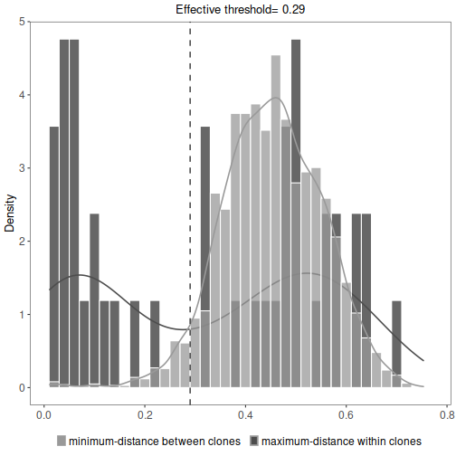

# B cell clonal relationships inference

## Introduction

A key step to higher-level quantitative analysis of Adaptive Immune Receptor Repertoire sequencing 
(AIRR-Seq) data is the identification of B cell clones (sequences derived from cells descended 
from a common ancestor), using computationally-driven approaches. Accurate identification of 
clonal relationships is critical as these clonal groups form the fundamental basis for a wide 
range of repertoire analyses, including diversity analysis, lineage reconstruction, and 
effector functionality. Recent advances in next-generation sequencing have enabled large-scale 
profiling of the B cell immunoglobulin repertoire from blood and tissue samples. Thus, a key computational 
challenge in the analysis of these data is to infer clonal relationships. `scoper` provides a computational 
framework for identification of B cell clones from AIRR-Seq data. Three main functions are included 
(`identicalClones`, `hierarchicalClones`, and `spectralClones`) that infer clonal relationships among 
sequences of BCRs/IGs (B cell receptors/immunoglobulins) which share the same V gene, J gene and 
junction length.

## Example data

A small example AIRR Rearrangement database is included in the `scoper` package. 
The example dataset consists of a subset of Ig sequencing data from an 
influenza vaccination study (Laserson and Vigneault et al., PNAS, 2014). The 
data include sequences from multiple time-points before and after the subject 
received an influenza vaccination. Identification of clones requires the following 
fields (columns) to be present in the table: 

* `junction`
* `v_call`
* `j_call`
* `sequence_alignment`
* `germline_alignment_d_mask`


```r
# Load scoper
library("scoper")
```

## Clonal assignments using identicalClones function

The simplest methodology to infer clonal relationships is to define
clones among identical junctions (i.e., where the V, D, and J gene segments join). 
This can be done using `identicalClones` function. Using this 
function user can identify clones (1) in nucleotide level (`nt`:nucleotide based clustering), or 
(2) amino acid level (`aa`: amino acid based clustering). 


```r
# Clonal assignment using the identical model
results <- identicalClones(db = ExampleDb,
                           method = "nt",
                           junction = "junction", 
                           v_call = "v_call", j_call = "j_call",
                           summarize_clones = TRUE)

# results is an object of class ScoperClones
class(results)
```

```
## [1] "ScoperClones"
## attr(,"package")
## [1] "scoper"
```

```r
# cloned data (a data.frame)
cloned_db <- results@db
# get inter and intra conal distances (a data.frame)
df <- results@inter_intra
```

User can plot the results from `summarize_clones=TRUE`, including the minimum inter (between) 
clonal distances.


```r
# plot a histogram of inter clonal distances  (a ggplot):
plot(results, binwidth=0.02)
```


## Clonal assignments using hierarchicalClones function

Most current studies however uses a more sophisticated definition 
for clonal relationships. These studies leverage the high diversity of 
the junction region as a fingerprint to identify each B cell clone. Because it is unlikely 
that two separate recombination events would lead to identical junctions, sequences with junction 
regions that are similar enough are determined to share a common B cell ancestor 
(i.e., be clonally related) rather than to have arisen independently. Hierarchical clustering 
is a widely used distance-based method for identify clonally related sequences. The three available 
agglomeration linkages are: (1) `single`, (2) `average`, and (3) `complete`.
It is important to determine an appropriate threshold for trimming the hierarchical 
clustering into B cell clones before using this model. The ideal threshold for separating 
clonal groups is the value that separates the two modes of the nearest-neighbor distance
distribution. The nearest-neighbor distance distribution can be generated by using the 
`distToNearest` function in the [shazam](https://shazam.readthedocs.io) R package.
The threshold itself can be found using the `findThreshold` function in the same package.
The resulting distribution should be bimodal, with the first mode representing sequences 
with clonal relatives in the dataset and the second mode representing singletons. 
For further details regarding inferring an appropriate threshold for the hierarchical 
clustering method, see the 
[Distance-to-Nearest vignette](https://shazam.readthedocs.io/en/stable/vignettes/DistToNearest-Vignette). 
Technical details can be found in:

    Gupta NT, et al. (2017). Hierarchical clustering can identify B cell clones with
        high confidence in Ig repertoire sequencing data.
        The Journal of Immunology 198(6):2489-2499.


```r
# Clonal assignment using the hierarchical model
results <- hierarchicalClones(db = ExampleDb, threshold = 0.15,
                              method = "nt",
                              linkage = "single",
                              junction = "junction", 
                              v_call = "v_call", j_call = "j_call",
                              max_n = NULL, log = NULL,
                              summarize_clones = TRUE)

# results is an object of class ScoperClones
class(results)
```

```
## [1] "ScoperClones"
## attr(,"package")
## [1] "scoper"
```

```r
# cloned data (a data.frame)
cloned_db <- results@db
# print effective threshold (a numeric):
results@eff_threshold
```

```
## [1] 0.22
```

Effective threshold is an explanatory value calculated to represent the cut-off separating the inter (between) 
and intra (within) clonal distances. It may differ from threshold provided for the function.


```r
# get inter and intra conal distances (a data.frame)
df <- results@inter_intra
```

User can plot the results from `summarize_clones=TRUE`, including the minimum inter (between) 
and maximum intra (within) clonal distances, and the calculated efective threshold.


```r
# plot a histogram of inter versus intra clonal distances  (a ggplot):
plot(results, binwidth=0.02)
```


## Clonal assignments using spectralClones function

While the hierarchical clustering-based model groups sequences using 
a fixed distance supervised threshold, the spectral clustering-based model uses an adaptive 
unsupervised threshold to tune the required level of similarity among sequences in different 
local neighborhoods. It can be used as an alternative if the nearest-neighbor distance distribution 
is unimodal (so `findThreshold` wasn't able to find the threshold at which to cut the hierarchy, 
see above). The two available methods are: (1) `novj`: clonal relationships are inferred using an adaptive 
threshold that indicates the level of similarity among junction sequences in a local neighborhood, 
and (2) `vj`: clonal relationships are inferred not only based on the junction region homology, 
but also taking into account the mutation profiles in the V and J segments. It is not mandatory, but the 
fixed threshold can also be used for the model `spectralClones`  in order to enforce an upper-limit cut-off. 
Using this argument, any sequence with distances above the threshold value from all sequences, will 
become a singleton. The threshold can be defined as discussed above from distance-to-nearest distribution 
(`findThreshold` function in the `SHazaM` R package). Technical details can be found in:

    Nouri N and Kleinstein SH (2018). A spectral clustering-based method for
        identifying clones from high-throughput B cell repertoire sequencing data.
        Bioinformatics, 34(13):i341-i349.

    Nouri N and Kleinstein SH (2019). Somatic hypermutation analysis for improved
        identification of B cell clonal families from next-generation sequencing data,
        bioRxiv doi: 10.1101/788620.


```r
# Clonal assignment using the spectral model
# IMGT_V object from shazam package to identify sequence limit length
library("shazam")
results <- spectralClones(db = ExampleDb, method = "vj",
                          len_limit = shazam::IMGT_V,
                          sequence = "sequence_alignment",
                          germline = "germline_alignment_d_mask",
                          junction = "junction",
                          v_call = "v_call", j_call = "j_call",
                          max_n = NULL, log = NULL,
                          threshold = 0.15, summarize_clones = TRUE)
# results is an object of class ScoperClones
class(results)
```

```
## [1] "ScoperClones"
## attr(,"package")
## [1] "scoper"
```

```r
# cloned data (a data.frame), with the column `clone_id`
cloned_db <- results@db
# print effective threshold (a numeric):
results@eff_threshold
```

```
## [1] 0.23
```

Effective threshold is an explanatory value calculated to represent the cut-off separating the inter (between) 
and intra (within) clonal distances. It may differ from threshold provided for the function.


```r
# get inter and intra clonal distances (a data.frame)
df <- results@inter_intra
```

User can plot the results from `summarize_clones=TRUE`, including the minimum inter (between) 
and maximum intra (within) clonal distances, and the calculated efective threshold.


```r
# plot a histogram of inter versus intra clonal distances  (a ggplot):
plot(results, binwidth=0.02)
```




