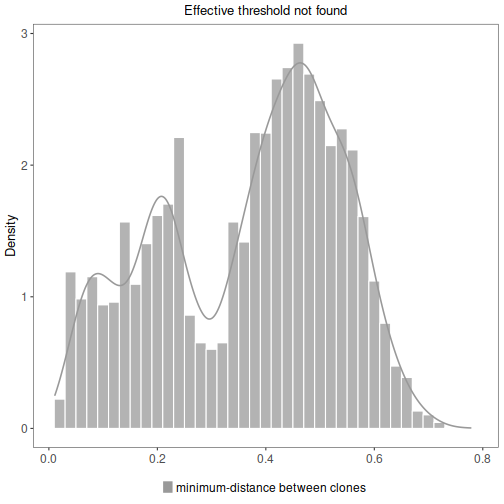
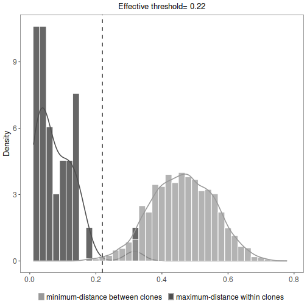
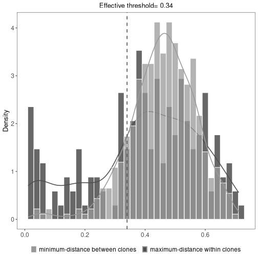

# Inferring B cell clonal relationships

## Introduction

A key step to higher-level quantitative analysis of Adaptive Immune Receptor Repertoire sequencing 
(AIRR-Seq) data is the identification of B cell clones (sequences derived from cells descended 
from a common ancestor) using computationally-driven approaches. Accurate identification of 
clonal relationships is critical as these clonal groups form the fundamental basis for a wide 
range of repertoire analyses, including diversity analysis, lineage reconstruction, and 
effector functionality. 

`scoper` provides a computational framework for identification of B cell 
clones from AIRR-Seq data among Ig (immunoglobulin, B cell receptor, BCR) sequences which share the 
same V gene, J gene and junction length. It includes methods to infer clonal relationships using
either a predefined clustering threshold or an adaptive threshold.

## Example data

A small example AIRR Rearrangement dataset is included in the `scoper` package. 
The dataset consists of a subset of Ig sequencing data from an 
influenza vaccination study (Laserson and Vigneault et al., PNAS, 2014). It 
includes sequences from multiple time-points before and after the subject 
received an influenza vaccination. Identification of clones requires the following 
fields (columns) to be present in the table: 

* `junction`
* `v_call`
* `j_call`
* `sequence_alignment`
* `germline_alignment_d_mask`

## Identifying clones by sequence identity

The simplest method for inferring clonal relationships is to define
clones among identical junction region sequences (the junction region is where the V, D, and J gene 
segments join). This can be done using the `identicalClones` function at either the nucleotide level 
(`method="nt"`) or the amino acid level (`method="aa"`):


```r
# Imports
library(scoper)
library(dplyr)

# Clonal assignment using identical nucleotide sequences
results <- identicalClones(ExampleDb, method="nt")
```

A modified input data.frame with clonal identifiers in the `clone_id` column is contained in the
`db` slot of the returned returned `ScoperClones` object, which can also be accessed by
calling `as.data.frame` on the result object.


```r
# Get results data.frame
results_db <- as.data.frame(results)
glimpse(results_db)
```

```
## Rows: 2,000
## Columns: 16
## $ sequence_id               <chr> "GN5SHBT08JPUYU", "GN5SHBT01EOOGB", "GN5SHBT05IQQ1G", "GN5…
## $ sequence_alignment        <chr> "CAGGTTCAACTGGTGCAGTCTGGAGCT...GAGGTGAAAAAGCCTGGGGCCTCAGTG…
## $ germline_alignment        <chr> "CAGGTTCAGCTGGTGCAGTCTGGAGCT...GAGGTGAAGAAGCCTGGGGCCTCAGTG…
## $ germline_alignment_d_mask <chr> "CAGGTTCAGCTGGTGCAGTCTGGAGCT...GAGGTGAAGAAGCCTGGGGCCTCAGTG…
## $ v_call                    <chr> "Homsap IGHV1-18*01 F", "Homsap IGHV1-18*01 F", "Homsap IG…
## $ v_call_genotyped          <chr> "IGHV1-18*01", "IGHV1-18*01", "IGHV1-18*01", "IGHV1-18*01"…
## $ d_call                    <chr> "Homsap IGHD3-9*01 F", "Homsap IGHD2-8*01 F", "Homsap IGHD…
## $ j_call                    <chr> "Homsap IGHJ4*03 F", "Homsap IGHJ4*02 F", "Homsap IGHJ4*03…
## $ c_call                    <chr> "IGHA", "IGHM", "IGHM", "IGHM", "IGHM", "IGHM", "IGHD", "I…
## $ junction                  <chr> "TGTGCAAGAATGAAGTATTACGATATTTTGACTGGTTACGAGCCGACCGCTTATTTC…
## $ junction_length           <dbl> 81, 81, 81, 81, 81, 81, 81, 81, 81, 81, 81, 81, 81, 81, 81…
## $ np1_length                <dbl> 5, 6, 6, 27, 7, 11, 13, 13, 16, 7, 26, 21, 11, 20, 26, 9, …
## $ np2_length                <dbl> 34, 23, 37, 6, 37, 27, 18, 18, 28, 27, 9, 17, 30, 21, 31, …
## $ duplicate_count           <dbl> 1, 1, 2, 1, 1, 1, 1, 1, 1, 1, 1, 2, 2, 1, 1, 1, 1, 1, 1, 1…
## $ sample_id                 <chr> "-1h", "-1h", "-1h", "-1h", "-1h", "-1h", "-1h", "-1h", "-…
## $ clone_id                  <chr> "1", "2", "3", "4", "5", "6", "7", "7", "8", "9", "10", "1…
```

A summary of the results can be plotted by calling `plot` on the returned `ScoperClones` object.
This will show the minimum inter (between) clonal distances. A detailed summary of clonal 
relationships as a `data.frame` is also available through a call to `summary` on the results object.


```r
# Plot a histogram of inter clonal distances
plot(results, binwidth=0.02)
```



```r
# Get summary data.frame
glimpse(summary(results))
```

```
## Rows: 156
## Columns: 7
## $ vjl_group       <int> 1, 2, 3, 4, 5, 6, 7, 8, 9, 10, 11, 12, 13, 14, 15, 16, 17, 18, 19, 2…
## $ sequence_count  <int> 20, 1, 1, 1, 12, 7, 3, 1, 12, 5, 37, 4, 5, 10, 6, 9, 5, 4, 5, 2, 4, …
## $ v_call          <chr> "Homsap IGHV1-18*01 F", "Homsap IGHV1-46*01 F,Homsap IGHV1-46*03 F",…
## $ j_call          <chr> "Homsap IGHJ4*03 F,Homsap IGHJ4*02 F,Homsap IGHJ4*01 F", "Homsap IGH…
## $ junction_length <int> 81, 81, 60, 102, 69, 66, 84, 96, 66, 75, 75, 84, 93, 60, 75, 87, 54,…
## $ clone_count     <int> 19, 1, 1, 1, 10, 7, 3, 1, 11, 4, 36, 4, 3, 8, 5, 9, 5, 4, 5, 2, 3, 1…
## $ clone_id        <chr> "1,2,3,4,5,6,7,8,9,10,11,12,13,14,15,16,17,18,19", "547", "611", "72…
```

## Identifying clones by hierarchical clustering

Most current studies uses a more sophisticated definition for clonal relationships. These studies 
leverage the high diversity of the junction region as a fingerprint to identify each B cell clone. 
Since it is unlikely that two separate recombination events would lead to identical junctions, 
sequences with junction regions that are similar enough are determined to share a common B cell 
ancestor (i.e., be clonally related) rather than to have arisen independently. Hierarchical 
clustering is a widely used distance-based method for identify clonally related sequences.
An implementation of the hierarchical clustering approach is provided via the `hierachicalClones`
function.

It is important to determine an appropriate threshold for trimming the hierarchical 
clustering into B cell clones before using this method. The ideal threshold for separating 
clonal groups is the value that separates the two modes of the nearest-neighbor distance
distribution. The nearest-neighbor distance distribution can be generated by using the 
`distToNearest` function in the [shazam](https://shazam.readthedocs.io) R package.
The threshold itself can be found using the `findThreshold` function in the same package.
The resulting distribution should be bimodal, with the first mode representing sequences 
with clonal relatives in the dataset and the second mode representing singletons. 
For further details regarding inferring an appropriate threshold for the hierarchical 
clustering method, see the 
[Distance to Nearest Neighbor](https://shazam.readthedocs.io/en/stable/vignettes/DistToNearest-Vignette) 
vignette in the [shazam](https://shazam.readthedocs.io) package. 
Technical details can be found in:

    Gupta NT, et al. (2017). Hierarchical clustering can identify B cell clones with
        high confidence in Ig repertoire sequencing data.
        The Journal of Immunology 198(6):2489-2499.

Identifying clonal groups using `hierachicalClones` is largely the same as the approach using the 
`identicalClones` function, with the additional requirement of a distance threshold:


```r
# Clonal assignment using hierarchical clustering
results <- hierarchicalClones(ExampleDb, threshold=0.15)
```

The results data.frame, summary plots, and summary table are accessed in the same manner as above.
This will show the minimum inter (between) and maximum intra (within) clonal distances along with
an effective threshold, which is an explanatory value calculated to represent the cut-off separating 
the inter and intra clonal distances. The effective threshold may differ from clustering threshold 
provided as input to `hierarchicalClones`.


```r
# Get results data.frame
results_db <- as.data.frame(results)
glimpse(results_db)
```

```
## Rows: 2,000
## Columns: 16
## $ sequence_id               <chr> "GN5SHBT01EOOGB", "GN5SHBT06H5CUA", "GN5SHBT04EFLMK", "GN5…
## $ sequence_alignment        <chr> "CAGGTTCAGCTGGTGCAGTCTGGAGCT...GAGGTGAAGAAGCCTGGGGCCTCAGTG…
## $ germline_alignment        <chr> "CAGGTTCAGCTGGTGCAGTCTGGAGCT...GAGGTGAAGAAGCCTGGGGCCTCAGTG…
## $ germline_alignment_d_mask <chr> "CAGGTTCAGCTGGTGCAGTCTGGAGCT...GAGGTGAAGAAGCCTGGGGCCTCAGTG…
## $ v_call                    <chr> "Homsap IGHV1-18*01 F", "Homsap IGHV1-18*01 F", "Homsap IG…
## $ v_call_genotyped          <chr> "IGHV1-18*01", "IGHV1-18*01", "IGHV1-18*01", "IGHV1-18*01"…
## $ d_call                    <chr> "Homsap IGHD2-8*01 F", "Homsap IGHD3-22*01 F", "Homsap IGH…
## $ j_call                    <chr> "Homsap IGHJ4*02 F", "Homsap IGHJ4*03 F", "Homsap IGHJ4*03…
## $ c_call                    <chr> "IGHM", "IGHM", "IGHD", "IGHD", "IGHM", "IGHM", "IGHM", "I…
## $ junction                  <chr> "TGTGCGAGAGATCTGGGGGATATTGTACTAATGGTGTATGCCGACCAGTACCCCATA…
## $ junction_length           <dbl> 81, 81, 81, 81, 81, 81, 81, 81, 81, 81, 81, 81, 81, 81, 81…
## $ np1_length                <dbl> 6, 19, 13, 13, 27, 26, 16, 7, 20, 19, 26, 9, 5, 11, 7, 6, …
## $ np2_length                <dbl> 23, 16, 18, 18, 6, 9, 28, 27, 21, 16, 31, 35, 34, 30, 37, …
## $ duplicate_count           <dbl> 1, 1, 1, 1, 1, 1, 1, 1, 1, 1, 1, 1, 1, 2, 1, 2, 1, 2, 1, 1…
## $ sample_id                 <chr> "-1h", "-1h", "-1h", "-1h", "-1h", "-1h", "-1h", "-1h", "-…
## $ clone_id                  <chr> "1", "2", "3", "3", "4", "5", "6", "7", "8", "9", "10", "1…
```

```r
# Plot a histogram of inter clonal distances
plot(results, binwidth=0.02)
```



```r
# Get summary data.frame
glimpse(summary(results))
```

```
## Rows: 156
## Columns: 7
## $ vjl_group       <int> 1, 2, 3, 4, 5, 6, 7, 8, 9, 10, 11, 12, 13, 14, 15, 16, 17, 18, 19, 2…
## $ sequence_count  <int> 20, 1, 1, 1, 12, 7, 3, 1, 12, 5, 37, 4, 5, 10, 6, 9, 5, 4, 5, 2, 4, …
## $ v_call          <chr> "Homsap IGHV1-18*01 F", "Homsap IGHV1-46*01 F,Homsap IGHV1-46*03 F",…
## $ j_call          <chr> "Homsap IGHJ4*02 F,Homsap IGHJ4*03 F,Homsap IGHJ4*01 F", "Homsap IGH…
## $ junction_length <int> 81, 81, 60, 102, 69, 66, 84, 96, 66, 75, 75, 84, 93, 60, 75, 87, 54,…
## $ clone_count     <int> 19, 1, 1, 1, 5, 7, 3, 1, 11, 4, 36, 4, 3, 6, 5, 9, 5, 4, 5, 2, 3, 1,…
## $ clone_id        <chr> "1,2,3,4,5,6,7,8,9,10,11,12,13,14,15,16,17,18,19", "518", "582", "68…
```

## Identifying clones by spectral clustering

While the hierarchical clustering method groups sequences using a fixed distance supervised threshold, 
the spectral clustering-based model uses an adaptive unsupervised threshold to tune the required 
level of similarity among sequences in different local neighborhoods. It can be used as an alternative 
if the nearest-neighbor distance distribution is unimodal, meaning that `findThreshold` wasn't able to find 
the threshold at which to cut the hierarchy. 

There are two available spectral clustering methods provided by the `spectralClones`  function:

1. `method="novj"`: Infers clonal relationships using an adaptive threshold that indicates the level 
    of similarity among junction sequences in a local neighborhood
2. `method="vj"`: Infers clonal relationships not only based on the junction region homology, 
    but also taking into account the mutation profiles in the V and J segments
    
It is not mandatory, but a fixed threshold can also be provided to `spectralClones` 
(`threshold` argument) which will enforce an upper-limit cut-off. When specifying the `threshold` 
argument, any sequence with distances above the threshold value from all sequences will become a 
singleton. The threshold can be defined as discussed above using nearest-neighbor distance 
distribution methods provided in the [shazam](https://shazam.readthedocs.io). If `method="vj"`, 
the `threshold` will be applied on the distances calculated combining junction region homology 
and V/J mutation profiles. Technical details can be found in:

    Nouri N and Kleinstein SH (2018). A spectral clustering-based method for
        identifying clones from high-throughput B cell repertoire sequencing data.
        Bioinformatics, 34(13):i341-i349.

    Nouri N and Kleinstein SH (2019). Somatic hypermutation analysis for improved
        identification of B cell clonal families from next-generation sequencing data,
        bioRxiv doi: 10.1101/788620.

The following example calls the `spectralClones` function using the same (optional) threshold used 
previously to defined clones using the hierachical approach:


```r
# Clonal assignment using the spectral clustering
results <- spectralClones(ExampleDb, method="vj",
                          threshold=0.15,
                          germline="germline_alignment_d_mask")
```

The results data.frame, summary plots, and summary table are accessed in the same manner as shown 
above using the hierachical approach.


```r
# Get results data.frame
results_db <- as.data.frame(results)
glimpse(results_db)
```

```
## Rows: 2,000
## Columns: 16
## $ sequence_id               <chr> "GN5SHBT01EOOGB", "GN5SHBT06H5CUA", "GN5SHBT04EFLMK", "GN5…
## $ sequence_alignment        <chr> "CAGGTTCAGCTGGTGCAGTCTGGAGCT...GAGGTGAAGAAGCCTGGGGCCTCAGTG…
## $ germline_alignment        <chr> "CAGGTTCAGCTGGTGCAGTCTGGAGCT...GAGGTGAAGAAGCCTGGGGCCTCAGTG…
## $ germline_alignment_d_mask <chr> "CAGGTTCAGCTGGTGCAGTCTGGAGCT...GAGGTGAAGAAGCCTGGGGCCTCAGTG…
## $ v_call                    <chr> "Homsap IGHV1-18*01 F", "Homsap IGHV1-18*01 F", "Homsap IG…
## $ v_call_genotyped          <chr> "IGHV1-18*01", "IGHV1-18*01", "IGHV1-18*01", "IGHV1-18*01"…
## $ d_call                    <chr> "Homsap IGHD2-8*01 F", "Homsap IGHD3-22*01 F", "Homsap IGH…
## $ j_call                    <chr> "Homsap IGHJ4*02 F", "Homsap IGHJ4*03 F", "Homsap IGHJ4*03…
## $ c_call                    <chr> "IGHM", "IGHM", "IGHD", "IGHD", "IGHM", "IGHM", "IGHM", "I…
## $ junction                  <chr> "TGTGCGAGAGATCTGGGGGATATTGTACTAATGGTGTATGCCGACCAGTACCCCATA…
## $ junction_length           <dbl> 81, 81, 81, 81, 81, 81, 81, 81, 81, 81, 81, 81, 81, 81, 81…
## $ np1_length                <dbl> 6, 19, 13, 13, 27, 26, 16, 7, 20, 19, 26, 9, 5, 11, 7, 6, …
## $ np2_length                <dbl> 23, 16, 18, 18, 6, 9, 28, 27, 21, 16, 31, 35, 34, 30, 37, …
## $ duplicate_count           <dbl> 1, 1, 1, 1, 1, 1, 1, 1, 1, 1, 1, 1, 1, 2, 1, 2, 1, 2, 1, 1…
## $ sample_id                 <chr> "-1h", "-1h", "-1h", "-1h", "-1h", "-1h", "-1h", "-1h", "-…
## $ clone_id                  <chr> "1", "2", "3", "3", "4", "5", "6", "7", "8", "9", "10", "1…
```

```r
# Plot a histogram of inter clonal distances
plot(results, binwidth=0.02)
```



```r
# Get summary data.frame
glimpse(summary(results))
```

```
## Rows: 156
## Columns: 7
## $ vjl_group       <int> 1, 2, 3, 4, 5, 6, 7, 8, 9, 10, 11, 12, 13, 14, 15, 16, 17, 18, 19, 2…
## $ sequence_count  <int> 20, 1, 1, 1, 12, 7, 3, 1, 12, 5, 37, 4, 5, 10, 6, 9, 5, 4, 5, 2, 4, …
## $ v_call          <chr> "Homsap IGHV1-18*01 F", "Homsap IGHV1-46*01 F,Homsap IGHV1-46*03 F",…
## $ j_call          <chr> "Homsap IGHJ4*02 F,Homsap IGHJ4*03 F,Homsap IGHJ4*01 F", "Homsap IGH…
## $ junction_length <int> 81, 81, 60, 102, 69, 66, 84, 96, 66, 75, 75, 84, 93, 60, 75, 87, 54,…
## $ clone_count     <int> 19, 1, 1, 1, 6, 7, 3, 1, 11, 4, 9, 4, 3, 7, 5, 9, 4, 3, 3, 2, 3, 1, …
## $ clone_id        <chr> "1,2,3,4,5,6,7,8,9,10,11,12,13,14,15,16,17,18,19", "465", "514", "58…
```

